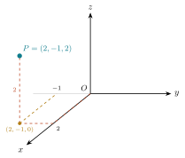
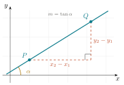

# Sistemas de coordenadas {#sec-coordenadas}

::: {.callout-tip title="Objetivos del capítulo"}
- Localizar puntos en la recta, en el plano y en el espacio, y describir cuadrantes y octantes.
- Deducir y aplicar la **fórmula de la distancia** entre dos puntos en $\mathbb{R}^2$ y en $\mathbb{R}^3$, y reconocer sus propiedades.
- Escribir la ecuación de los planos coordenados y de sus paralelos.
- Calcular la **inclinación** y la **pendiente** de una recta.
- Reconocer un **lugar geométrico** y traducir una condición geométrica a una ecuación, y una ecuación a su figura.
- Distinguir cuándo una ecuación describe una curva y cuándo una superficie.
:::

## El método de Descartes

En 1637, como apéndice de su *Discurso del método*, René Descartes publicó *La Géométrie*. La idea que contiene se ha vuelto tan familiar que resulta difícil apreciar cuán audaz fue: **asignar números a los puntos del plano** para tratar problemas de figuras con las herramientas del álgebra.

Antes de eso, la geometría griega demostraba que dos rectas se cortan en un punto trazándolas. Después de Descartes, se demuestra resolviendo un sistema de ecuaciones. Ambos procedimientos son legítimos, pero el segundo ofrece una ventaja decisiva. El cálculo es **sistemático**, de modo que no depende del ingenio particular ni de la precisión del trazo.

::: {.callout-note collapse="true" title="Nota histórica — Dos inventores y un apéndice"}
La historia es más curiosa de lo que sugiere el nombre "plano cartesiano". La idea la tuvieron **dos personas, por separado y casi al mismo tiempo**. Descartes la publicó en 1637, pero Pierre de **Fermat** (el mismo del famoso "último teorema") la había desarrollado unos años antes en un manuscrito (*Ad locos planos et solidos isagoge*) que circuló entre matemáticos y sólo se imprimió tras su muerte. Como Descartes publicó primero, el plano lleva su nombre: *cartesiano* viene de **Cartesius**, la forma latinizada de Descartes.

Hay un segundo aspecto notable. *La Géométrie* no emplea ejes perpendiculares fijos como los actuales, ni la pareja $(x,y)$ tal como la escribimos. La maquinaria que usamos hoy (ejes, cuadrantes, la notación) se fue puliendo durante el siglo siguiente, en buena parte gracias a **Euler**. Lo que Descartes y Fermat aportaron fue la idea de fondo, que una curva puede *ser* una ecuación.
:::

Lo que hace un sistema de coordenadas, dicho con precisión, es establecer una **correspondencia biunívoca** entre los puntos de una figura geométrica y las parejas (o ternas) de números reales. Esa correspondencia es un **diccionario**, y como todo diccionario permite traducir en las dos direcciones.

| Objeto geométrico | Objeto algebraico |
|---|---|
| Un punto | Una pareja $(x,y)$ |
| Una curva | Una ecuación en $x$ e $y$ |
| "Estas dos rectas se cortan" | "Este sistema tiene solución" |
| "Estos tres puntos son colineales" | "Este determinante vale cero" |

::: {.callout-tip title="Una pregunta recurrente"}
Cada vez que aparece un objeto nuevo, conviene preguntarse cuál es su **traducción** al otro idioma. Y cada vez que se resuelve algo con álgebra, conviene preguntarse **qué significa geométricamente** el resultado. Ese doble tránsito constituye el contenido del curso.
:::

## Localización: la recta, el plano, el espacio

### La recta real

Si fijamos en una recta un punto llamado **origen**, un **sentido** positivo y una **unidad de longitud**, cada punto queda identificado por un número real y cada número real determina un punto. Es la primera correspondencia biunívoca, y la más simple.

### El plano

Dos rectas perpendiculares que se cortan en un origen común (los **ejes**) dividen el plano en cuatro **cuadrantes** y permiten localizar cualquier punto con una pareja ordenada $(x,y)$. La primera coordenada es la **abscisa** y la segunda la **ordenada**.

Que la pareja sea *ordenada* no es un tecnicismo, porque $(3,5)$ y $(5,3)$ son puntos distintos. El conjunto de todas esas parejas se denota
$$
\mathbb{R}^2=\{(x,y): x\in\mathbb{R},\ y\in\mathbb{R}\}.
$$

Los signos de las coordenadas determinan el cuadrante, y la lectura funciona también al revés. Si se sabe que $xy<0$, los signos son opuestos y el punto está en el cuadrante II o en el IV.

::: {.callout-note collapse="true" title="Nota al margen — De dónde vienen «abscisa» y «ordenada»"}
Las dos palabras proceden del latín empleado en los tratados de geometría. *Abscisa* viene de **linea abscissa**, "línea cortada", el tramo que la coordenada corta sobre el eje horizontal. *Ordenada* viene de **linea ordinatim applicata**, "línea aplicada ordenadamente", los segmentos paralelos que se levantan, en orden, desde el eje hasta la curva. Los términos ya se usaban en el estudio de las cónicas *antes* de Descartes; el plano cartesiano los heredó y los volvió coordenadas.
:::

### El espacio

Con tres ejes mutuamente perpendiculares, cada punto queda determinado por una terna $(x,y,z)$, y el espacio se denota $\mathbb{R}^3$. Los tres planos coordenados ($XY$, $XZ$, $YZ$) dividen el espacio en ocho **octantes**. Los cuatro de arriba se numeran del I al IV siguiendo a los cuadrantes del plano $XY$, y los cuatro de abajo, del V al VIII, quedan justo debajo de ellos.

{width=34% fig-align="center"}

Usamos siempre el sistema **derecho**, aquel en el que, si los dedos de la mano derecha giran del eje $X$ al eje $Y$, el pulgar apunta en el sentido positivo del eje $Z$. La orientación tendrá consecuencias reales al llegar al producto cruz.

Al dibujar conservamos siempre la misma vista, para no tener que reinterpretar cada figura. El eje $X$ apunta hacia quien mira, el eje $Y$ hacia la derecha y el eje $Z$ hacia arriba (sus partes positivas). Una referencia útil es la esquina del salón donde concurren dos paredes y el piso, cuyas tres aristas corresponden a los tres ejes.

Para dibujar un punto conviene **puntear su trayectoria** desde el origen, es decir, las unidades que se avanzan al frente, las que se avanzan a la derecha o a la izquierda y las que se suben. En la figura, $P=(2,-1,2)$ se alcanza avanzando $2$ unidades sobre el eje $X$, una unidad a la izquierda (porque $y=-1$) y $2$ unidades hacia arriba.

{width=38% fig-align="center"}

Sin esas líneas la perspectiva induce a error y el punto aparenta ocupar otra posición. Con ellas, su ubicación queda determinada sin ambigüedad.

::: {.callout-warning title="Un error muy frecuente al dibujar en el espacio"}
En el papel, el espacio se representa en perspectiva, de manera que dos puntos que aparentan estar próximos pueden encontrarse muy alejados. **La figura en $\mathbb{R}^3$ orienta, pero no constituye una demostración.** En el espacio, más aún que en el plano, conviene apoyarse en el cálculo y usar el dibujo únicamente como guía.
:::

::: {.callout-tip title="Visualización interactiva"}
En [geogebra.org/3d](https://www.geogebra.org/3d) la escena puede girarse con el ratón. Observar el mismo punto desde varias perspectivas es el modo más eficaz de comprobar que una sola vista resulta insuficiente.
:::

### Los planos coordenados y sus ecuaciones

Cada plano coordenado se describe con una ecuación de una sola variable, por el mismo razonamiento que en el plano hace del eje $X$ la recta $y=0$.

{width=42% fig-align="center"}

| Plano coordenado | Ecuación | Descripción |
|---|---|---|
| plano $xy$ | $z=0$ | los puntos de altura cero |
| plano $xz$ | $y=0$ | contiene a los ejes $x$ y $z$ |
| plano $yz$ | $x=0$ | contiene a los ejes $y$ y $z$ |

Los planos **paralelos** a los coordenados se describen igual. Los puntos con $y=3$ forman el plano paralelo al $xz$ que pasa por $(0,3,0),$ y los puntos con $z=-2$ forman el plano paralelo al $xy$, dos unidades abajo. La variable que no aparece en la ecuación es la que queda libre, y aquí quedan libres dos.

Si imponemos **dos** condiciones a la vez, por ejemplo $y=3$ y $z=2$, el resultado es una **recta** paralela al eje $x$, la intersección de dos planos.

## Lugares geométricos

Las ecuaciones que acaban de aparecer ($x=3$ en el plano, $z=0$ en el espacio, o el par $y=3$, $z=2$) son casos de un mismo concepto, el que organiza buena parte del curso.

::: {#def-lugar}
## Lugar geométrico

Un **lugar geométrico** es el conjunto de todos los puntos que cumplen una condición dada, y solamente ellos.
:::

Las dos palabras que hacen el trabajo son *"todos"* y *"solamente"*. Cuando afirmamos que cierta ecuación describe un lugar geométrico, estamos afirmando dos cosas a la vez:

1. Todo punto que cumple la condición satisface la ecuación.
2. Todo punto que satisface la ecuación cumple la condición.

Omitir la segunda es el error más frecuente. Al elevar al cuadrado, por ejemplo, pueden introducirse soluciones que no satisfacen la condición original.

### Los primeros ejemplos, en el plano

Los lugares geométricos más simples son las rectas paralelas a los ejes. Los puntos con abscisa $3$ forman la recta vertical $x=3$, y los puntos con ordenada $-2$ forman la recta horizontal $y=-2$. Los propios ejes son lugares geométricos: el eje $X$ es $y=0$ y el eje $Y$ es $x=0$. En todos estos casos la ecuación se obtiene de inmediato, porque la condición ya está escrita en el idioma de las coordenadas, y **la variable que no aparece es la que queda libre**.

### Los primeros ejemplos, en el espacio

En $\mathbb{R}^3$ el mismo razonamiento produce planos en lugar de rectas. Los tres planos coordenados son $z=0$, $y=0$ y $x=0$, y sus paralelos se describen fijando la misma variable en otro valor: $y=3$ es el plano paralelo al $xz$ que pasa por $(0,3,0)$.

### Varias condiciones a la vez

Un lugar geométrico puede estar descrito por **condiciones simultáneas**, y entonces se trata de la intersección de los lugares de cada una.

| Condición | En $\mathbb{R}^2$ | En $\mathbb{R}^3$ |
|---|---|---|
| $x=3$ | una recta vertical | un plano paralelo al $yz$ |
| $x=3$ y $y=-2$ | el punto $(3,-2)$ | una recta paralela al eje $z$ |
| $y=3$ y $z=2$ | --- | una recta paralela al eje $x$ |

El patrón es un conteo: cada ecuación recorta un grado de libertad. En el plano se parte de dos, así que una condición deja una recta y dos condiciones dejan un punto; en el espacio se parte de tres, así que una condición deja un plano, dos condiciones dejan una recta y tres condiciones dejan un punto. A ese conteo volvemos al cierre del capítulo.

::: {.callout-important title="La misma ecuación, objetos distintos"}
En $\mathbb{R}^2$ la ecuación $x=0$ deja libre una variable y describe una **recta**, el eje $Y$. En $\mathbb{R}^3$ la misma ecuación deja libres dos variables y describe un **plano**, el plano $yz$. Antes de responder qué describe una ecuación hay que saber dónde viven los puntos.
:::

## Distancia entre dos puntos del plano

Construimos la fórmula en dos pasos. Primero medimos desde el origen, donde el triángulo rectángulo aparece de inmediato, y después movemos ese mismo triángulo a una posición cualquiera.

### Del origen a un punto

Si $P=(x_1,y_1)$ está en el primer cuadrante, el segmento $OP$ es la hipotenusa de un triángulo rectángulo cuyos catetos son las coordenadas mismas de $P$. El cateto horizontal está sobre el eje $X$ y mide $x_1$, el vertical mide $y_1$, y el ángulo recto está en $(x_1,0)$.

{width=42% fig-align="center"}

Por el teorema de Pitágoras,
$$
d(O,P)=\sqrt{x_1^{\,2}+y_1^{\,2}} .
$$

En los demás cuadrantes el razonamiento es igual, con catetos $\lvert x_1\rvert$ y $\lvert y_1\rvert$. Los valores absolutos desaparecen al elevar al cuadrado, y por eso no aparecen en la fórmula.

### Entre dos puntos en el plano

Cuando ninguno de los dos puntos está en el origen, trasladamos el triángulo hasta que el vértice del ángulo recto quede en $(x_2,y_1)$. Los catetos dejan de ser coordenadas y pasan a ser **diferencias de coordenadas**, de modo que miden $\lvert x_2-x_1\rvert$ y $\lvert y_2-y_1\rvert$.

{width=50% fig-align="center"}

Aplicando otra vez el teorema de Pitágoras a este triángulo,
$$
d(P,Q)=\sqrt{(x_2-x_1)^2+(y_2-y_1)^2} .
$$

Cuando $P$ es el origen se tiene $x_1=y_1=0$, y la expresión se reduce a la del paso anterior.

::: {#thm-distancia}
## Distancia entre dos puntos del plano

Si $P=(x_1,y_1)$ y $Q=(x_2,y_2)$ son puntos del plano, la distancia entre ellos es
$$
d(P,Q)=\sqrt{(x_2-x_1)^2+(y_2-y_1)^2}.
$$
:::

Conviene observar dos hechos. El primero es que **la fórmula no constituye una definición**, sino una consecuencia del teorema de Pitágoras y, por tanto, de la geometría euclidiana. El segundo es que la fórmula adopta esa forma únicamente porque los ejes son **perpendiculares** y las unidades **iguales** en ambos. Con ejes oblicuos, la distancia se calcula de otro modo.

**Ejemplos.** $d\bigl((1,-2),(4,2)\bigr)=\sqrt{3^2+4^2}=5$ y $d\bigl((-3,1),(2,-1)\bigr)=\sqrt{5^2+(-2)^2}=\sqrt{29}$. Una convención que usamos todo el curso: **las raíces se dejan indicadas**, porque $\sqrt{29}$ es una respuesta exacta y $5.385\ldots$ es sólo una aproximación.

::: {.callout-note collapse="true" title="Nota histórica — Un teorema más viejo que Pitágoras"}
El teorema que sostiene toda esta sección es bastante más antiguo que el personaje que le da nombre. Una tablilla babilónica de arcilla conocida como **Plimpton 322**, escrita alrededor del año 1800 a.C. (unos doce siglos antes de Pitágoras), contiene una lista de ternas de números que cumplen $a^2+b^2=c^2$, como $(3,4,5)$ y otras mucho menos obvias. Los babilonios conocían la *relación*; la tradición griega aportó lo que convierte una observación en teorema, la **demostración**. Esa diferencia, saber que algo funciona contra saber *por qué* funciona, es una de las que este curso quiere dejar claras.
:::

## La distancia en el espacio {#sec-distancia-espacio}

El paso a $\mathbb{R}^3$ no requiere ideas nuevas, sino aplicar dos veces el mismo teorema. Conviene considerar la **caja** que tiene a los dos puntos como vértices opuestos y las aristas paralelas a los ejes, ya que el segmento por medir es su diagonal.

### Del origen a un punto del espacio

Tomamos $P=(x_1,y_1,z_1)$ y su proyección $P'=(x_1,y_1,0)$ sobre el plano $XY$. Aparecen dos triángulos rectángulos.

{width=46% fig-align="center"}

- El **triángulo del piso** tiene catetos $\lvert x_1\rvert$ y $\lvert y_1\rvert$, está contenido en el plano $XY$ y su hipotenusa mide $\overline{OP'}=\sqrt{x_1^{\,2}+y_1^{\,2}}$.
- El **triángulo vertical** tiene catetos $\overline{OP'}$ y $\lvert z_1\rvert$, está contenido en el plano vertical que pasa por $O$, $P'$ y $P$, y su hipotenusa es $d(O,P)$.

El segundo triángulo toma como cateto la hipotenusa del primero, de modo que
$$
d(O,P)^2=\overline{OP'}^{\,2}+z_1^{\,2}=x_1^{\,2}+y_1^{\,2}+z_1^{\,2}
$$
o bien 
$$
d(O,P)=\sqrt{x_1^{\,2}+y_1^{\,2}+z_1^{\,2}}
$$

Con $P=(2,6,3)$, por ejemplo, el triángulo del piso da $\overline{OP'}=\sqrt{4+36}=\sqrt{40}$ y el vertical da $d(O,P)=\sqrt{40+9}=\sqrt{49}=7$.

### Entre dos puntos cualesquiera

Para dos puntos cualesquiera sacamos la caja del rincón del origen y la colocamos en otro lugar, igual que trasladamos el triángulo en el plano. Con $P=(x_1,y_1,z_1)$ y $Q=(x_2,y_2,z_2)$, el vértice auxiliar es $R=(x_2,y_2,z_1)$, la proyección de $Q$ sobre el piso que pasa por $P$.

{width=42% fig-align="center"}

Las aristas de la caja miden ahora $\lvert x_2-x_1\rvert$, $\lvert y_2-y_1\rvert$ y $\lvert z_2-z_1\rvert$. El triángulo del piso da
$$
\overline{PR}^{\,2}=(x_2-x_1)^2+(y_2-y_1)^2 ,
$$
y del triángulo vertical, de catetos $\overline{PR}$ y $\lvert z_2-z_1\rvert$, concluimos que
$$
d(P,Q)^2=\overline{PR}^{\,2}+(z_2-z_1)^2=(x_2-x_1)^2+(y_2-y_1)^2+(z_2-z_1)^2 .
$$

o bien
$$
d(P,Q)=\sqrt{(x_2-x_1)^2+(y_2-y_1)^2+(z_2-z_1)^2}.
$$

Queda así demostrado el análogo espacial del @thm-distancia.

::: {#thm-distancia-espacio}
## Distancia entre dos puntos del espacio

Si $P=(x_1,y_1,z_1)$ y $Q=(x_2,y_2,z_2)$ son puntos del espacio, la distancia entre ellos es
$$
d(P,Q)=\sqrt{(x_2-x_1)^2+(y_2-y_1)^2+(z_2-z_1)^2}.
$$
:::

Conviene examinar los casos límite, que constituyen una comprobación elemental de que la fórmula está bien escrita. Si $P$ es el origen recuperamos la distancia desde el origen, y si $z_1=z_2$ el tercer sumando se anula y recuperamos la fórmula del plano.

**Ejemplo.** $d\bigl((2,-1,3),(0,1,2)\bigr)=\sqrt{4+4+1}=\sqrt{9}=3$.

## Propiedades de la distancia

Antes de calcular nada conviene preguntarse qué debería cumplir cualquier noción razonable de distancia. Para cualesquiera puntos $P$, $Q$ y $R$ se tiene:

1. **No negatividad.** $d(P,Q)\ \ge\ 0$, y $d(P,Q)=0$ si y sólo si $P=Q$.
2. **Simetría.** $d(P,Q)=d(Q,P)$.
3. **Desigualdad del triángulo.** $d(P,Q)\ \le\ d(P,R)+d(R,Q)$, con igualdad si y sólo si $R$ pertenece al segmento $PQ$.

Las tres resultan creíbles antes de cualquier cálculo. Una longitud no puede ser negativa, y la única manera de recorrer distancia cero es no moverse. El camino de ida mide lo mismo que el de vuelta. Y desviarse por un punto intermedio $R$ no puede *acortar* el trayecto de $P$ a $Q$; en el mejor de los casos lo iguala, exactamente cuando $R$ está sobre el segmento $PQ$.

Las dos primeras se verifican en un renglón sobre la fórmula. Una raíz de suma de cuadrados nunca es negativa, y vale cero únicamente cuando todos los cuadrados son cero, es decir cuando las coordenadas coinciden una a una. Y como $(x_2-x_1)^2=(x_1-x_2)^2$, elevar al cuadrado elimina el signo, de modo que intercambiar $P$ con $Q$ no cambia el valor.

En el espacio las verificaciones son las mismas, con un sumando más. Ésa es la ventaja de construir $\mathbb{R}^3$ en paralelo con $\mathbb{R}^2$: casi ningún resultado se demuestra de nuevo, y basta comprobar que el argumento anterior sigue siendo válido con una coordenada más.

::: {.callout-important title="Resultado pendiente de demostración"}
La tercera propiedad, la **desigualdad del triángulo**, queda enunciada y no demostrada. Su enunciado es igual de creíble que los otros dos, pero su demostración no sale de manipular la fórmula: requiere una herramienta que aún no se ha introducido, el producto punto, y se presenta en @sec-desigualdad-triangulo, donde la citaremos por su nombre. Distinguir con precisión lo demostrado de lo pendiente es parte del trabajo matemático.
:::

## Inclinación y pendiente de una recta

Además de localizar puntos y medir distancias, un sistema de coordenadas permite describir la **dirección** de una recta con un número.

::: {#def-inclinacion}
## Inclinación y pendiente

La **inclinación** de una recta no horizontal es el ángulo $\alpha$, con $0<\alpha<\pi$, que forma con el semieje positivo de las $x$, medido en sentido contrario al de las manecillas del reloj. La inclinación de una recta horizontal es cero. La **pendiente** de una recta no vertical es
$$
m=\tan\alpha .
$$
:::

{width=46% fig-align="center"}

Si la recta pasa por $P=(x_1,y_1)$ y $Q=(x_2,y_2)$, con $x_1\ne x_2$, el triángulo rectángulo de la figura tiene catetos $x_2-x_1$ y $y_2-y_1$, de modo que
$$
m=\frac{y_2-y_1}{x_2-x_1}.
$$

La pendiente es, entonces, la razón entre lo que la recta sube y lo que avanza. De esa lectura se siguen los casos que conviene reconocer de inmediato.

| Situación | Pendiente |
|---|---|
| Recta horizontal | $m=0$, porque $\alpha=0$ |
| Recta creciente | $m>0$, porque $0<\alpha<\pi/2$ |
| Recta decreciente | $m<0$, porque $\pi/2<\alpha<\pi$ |
| Recta vertical | No está definida, porque $x_2=x_1$ |

**Ejemplo.** La recta que pasa por $(-1,2)$ y $(3,4)$ tiene pendiente $m=\dfrac{4-2}{3-(-1)}=\dfrac12$, y su inclinación es $\alpha=\arctan\tfrac12\approx 26.57^\circ$.

Dos rectas no verticales son **paralelas** si y sólo si tienen la misma pendiente, porque tener la misma pendiente equivale a tener la misma inclinación. La condición de **perpendicularidad** también se escribe con pendientes, pero no se lee directamente de la definición: se obtiene del teorema del ángulo entre dos rectas, que se demuestra en @sec-recta.

## Cómo se halla un lugar geométrico

Los ejemplos anteriores resultaron inmediatos porque la condición ya venía escrita en coordenadas. Cuando la condición es geométrica (una igualdad de distancias, un ángulo, una razón) hay que traducirla, y la traducción sigue siempre el mismo esquema.

### El procedimiento, en cuatro pasos

Traducir una condición verbal a una ecuación sigue siempre el mismo esquema.

1. Llamar $P=(x,y)$ al punto genérico que cumple la condición.
2. Escribir la condición como una igualdad entre distancias, ángulos o áreas.
3. Sustituir cada elemento por su expresión en coordenadas.
4. Simplificar, cuidando de no perder ni ganar soluciones.

### Ejemplo trabajado

> **Hallar el lugar geométrico de los puntos cuya distancia al punto $C=(2,1)$ es igual a $3$.**

*Paso 1.* Sea $P=(x,y)$ un punto cualquiera del lugar.

*Paso 2.* La condición es $d(P,C)=3$.

*Paso 3.* En coordenadas,
$$
\sqrt{(x-2)^2+(y-1)^2}=3 .
$$

*Paso 4.* Ambos lados son no negativos, de modo que elevar al cuadrado es reversible aquí y no introduce soluciones falsas:
$$
(x-2)^2+(y-1)^2=9 .
$$

El lugar geométrico es la **circunferencia** de centro $C$ y radio $3$. Conviene leer el resultado en las dos direcciones, como pide el criterio de *todos* y *solamente*: todo punto a distancia $3$ de $C$ satisface la ecuación, y todo punto que la satisface está a distancia $3$ de $C$, porque el paso del cuadrado se puede deshacer.

## Curvas y superficies: qué esperar

Esta última sección anticipa el panorama de los capítulos siguientes.

En el plano, una ecuación $F(x,y)=0$ describe normalmente una **curva**, porque una condición sobre dos variables deja un grado de libertad. En el espacio, una ecuación $F(x,y,z)=0$ describe normalmente una **superficie**, porque una condición sobre tres variables deja dos grados de libertad.

De lo anterior se sigue un hecho notable: **una curva en el espacio requiere dos ecuaciones**, no una. Una sola ecuación no puede recortar el espacio hasta dejar sólo una dimensión.

| En $\mathbb{R}^2$ | En $\mathbb{R}^3$ |
|---|---|
| $F(x,y)=0$ → una curva | $F(x,y,z)=0$ → una superficie |
| Punto: dos ecuaciones | Curva: dos ecuaciones |
| | Punto: tres ecuaciones |

Este conteo de grados de libertad (que en su versión formal se llama *codimensión*) explicará más adelante por qué una recta en el espacio se describe con dos planos o con una parametrización, pero nunca con una sola ecuación lineal. No se trata de una convención de notación, sino de un conteo de dimensiones.

## Resumen

Un sistema de coordenadas establece una correspondencia biunívoca entre puntos y parejas o ternas de números, y con ella los problemas de figuras se vuelven problemas de cálculo. Sobre esa correspondencia se construyó todo el capítulo. El concepto de **lugar geométrico** fijó desde temprano el sentido preciso en que una ecuación describe una figura, con las palabras *todos* y *solamente*, y los primeros ejemplos (rectas paralelas a los ejes en el plano, planos y rectas en el espacio, condiciones simultáneas) mostraron que el resultado depende de cuántos grados de libertad recorta cada ecuación. La **distancia** entre dos puntos resultó del teorema de Pitágoras, primero en el plano y después en el espacio, donde el mismo teorema se aplica dos veces; de sus tres propiedades, dos quedaron verificadas y la desigualdad del triángulo quedó enunciada, con la demostración anotada como pendiente. La **pendiente** describió la dirección de una recta con un solo número, y con ella apareció la primera limitación del lenguaje clásico: las rectas verticales quedan fuera. El capítulo cierra con el conteo de grados de libertad que anticipa por qué en el plano una ecuación describe una curva y en el espacio una superficie.

---

## Ejercicios {.unnumbered}

### De la condición a la ecuación {.unnumbered}

**1.1** Hallar el lugar geométrico de los puntos cuya distancia al punto $(3,0)$ es igual a $5$.

**1.2** Hallar el lugar geométrico de los puntos que equidistan de $(0,4)$ y del eje $X$.

**1.3** Describir con una ecuación el lugar de los puntos que están a distancia $2$ del eje $X$, por arriba de él. ¿Y el de *todos* los puntos a distancia $2$ del eje $X$? (Este segundo lugar necesita dos rectas y puede escribirse como $\lvert y\rvert=2$; conviene explicar por qué funciona.)

**1.4** Hallar el lugar geométrico de los puntos $P$ tales que la suma de sus distancias a $(-3,0)$ y $(3,0)$ vale $10$. Simplificar todo lo posible. (Reaparece en el capítulo de cónicas, conviene guardar el resultado.)

### De la ecuación a la figura {.unnumbered}

**1.5** Describir con palabras, sin graficar, el lugar geométrico $x^2+y^2-6x+8y=0$. ¿Pasa por el origen?

**1.6** ¿Qué representa la ecuación $(x-1)^2+(y+2)^2=0$? ¿Y $(x-1)^2+(y+2)^2=-4$? Justificar la respuesta.

**1.7** Describir el conjunto de $\mathbb{R}^3$ dado por $z=2$. ¿Y el dado por $x=0$ **y** $z=2$?

**1.8** ¿En qué octante vive cada uno de los puntos $(1,2,3)$, $(2,-1,3)$ y $(-1,-2,-3)$? ¿Y dónde vive $(0,0,5)$?

**1.9** Escribir la ecuación del plano paralelo al plano $xz$ que pasa por $(0,-4,0)$, y la del plano paralelo al $xy$ que pasa por $(0,0,7)$.

### Distancia {.unnumbered}

**1.10** Calcular $d\bigl(O,(2,6,3)\bigr)$ y $d\bigl((2,-1,3),(0,1,2)\bigr)$. En los dos casos el resultado es un entero, y conviene identificar los dos triángulos rectángulos que intervienen en el primero.

**1.11** Con $A=(1,1)$, $B=(5,3)$ y $C=(3,7)$, calcular las tres distancias y decidir si el triángulo $ABC$ es isósceles. ¿Tiene algún ángulo recto? Basta el recíproco del teorema de Pitágoras.

**1.12** Encontrar los puntos del eje $X$ que están a distancia $5$ del punto $(3,4)$. ¿Cuántas soluciones se esperan geométricamente?

**1.13** Escribir la condición que cumplen los puntos de $\mathbb{R}^3$ que están a distancia $3$ del origen. ¿Qué figura describen?

### Inclinación y pendiente {.unnumbered}

**1.14** Calcular la pendiente y la inclinación de la recta que pasa por $(2,-1)$ y $(6,3)$.

**1.15** Determinar si las rectas que pasan por $(0,1)$ y $(4,3)$, y por $(1,5)$ y $(3,1)$, respectivamente, son paralelas. ¿Basta la pendiente para decidirlo?

### Desarrollo de conceptos {.unnumbered}

**1.16** Explicar en no más de media página por qué la fórmula de la distancia tiene la forma que tiene, y qué habría que cambiar si los ejes no fueran perpendiculares.

**1.17** La ecuación $x=0$ describe una recta en el plano y un plano en el espacio. Explicar la diferencia en términos de grados de libertad, y dar otro ejemplo del mismo fenómeno con una ecuación distinta.

**1.18** ¿Qué información se pierde al describir una recta únicamente con su pendiente? Señalar al menos un caso en el que ese resumen en un solo número resulte insuficiente.

::: {.callout-tip title="Soluciones y retroalimentación" collapse="true"}
**1.1** La condición es $d\bigl(P,(3,0)\bigr)=5$, es decir $\sqrt{(x-3)^2+y^2}=5$, y elevando al cuadrado, $(x-3)^2+y^2=25$. Es la circunferencia de centro $(3,0)$ y radio $5$. *Elevar al cuadrado es reversible porque los dos lados son no negativos.*

**1.2** La distancia de $P=(x,y)$ al eje $X$ es $\lvert y\rvert$, así que la condición es $\sqrt{x^2+(y-4)^2}=\lvert y\rvert$. Al elevar al cuadrado, $x^2+y^2-8y+16=y^2$, de donde $y=\dfrac{x^2+16}{8}$. Es una parábola. *Reaparece en el capítulo de cónicas con el nombre de definición foco-directriz.*

**1.3** Por arriba del eje, $y=2$, una recta horizontal. Si se piden todos los puntos a distancia $2$ hacen falta las dos rectas $y=2$ y $y=-2$, que juntas se escriben $\lvert y\rvert=2$. *La ecuación con valor absoluto funciona porque $\lvert y\rvert$ es exactamente la distancia al eje $X$, sin importar el signo.*

**1.4** Con $\sqrt{(x+3)^2+y^2}+\sqrt{(x-3)^2+y^2}=10$, aislando una raíz y elevando al cuadrado dos veces se llega a $\dfrac{x^2}{25}+\dfrac{y^2}{16}=1$. Es una elipse de semiejes $5$ y $4$. *El $16$ proviene de $25-9$, diferencia que más adelante recibirá un nombre propio.*

**1.5** Completando cuadrados, $(x-3)^2+(y+4)^2=25$, la circunferencia de centro $(3,-4)$ y radio $5$. Sí pasa por el origen, porque $(0,0)$ satisface la ecuación original. *También puede advertirse sin efectuar cálculos, ya que la ecuación carece de término independiente.*

**1.6** La primera se cumple sólo si los dos cuadrados son cero, así que describe **un único punto**, $(1,-2)$. La segunda no la cumple ningún punto real, porque una suma de cuadrados no es negativa. *Son los dos casos degenerados de la circunferencia, radio cero y radio imaginario.*

**1.7** $z=2$ es el plano paralelo al $xy$ que pasa dos unidades arriba. Las dos condiciones $x=0$ y $z=2$ describen la **recta** intersección de dos planos, paralela al eje $Y$. *Cada ecuación recorta un grado de libertad.*

**1.8** $(1,2,3)$ está en el octante I; $(2,-1,3)$ en el IV, con $x>0$, $y<0$, $z>0$; $(-1,-2,-3)$ queda abajo, en el VII. El punto $(0,0,5)$ está sobre el eje $Z$ y no pertenece a ningún octante, igual que en el plano los puntos de los ejes no están en ningún cuadrante.

**1.9** Paralelo al $xz$ por $(0,-4,0)$: $y=-4$. Paralelo al $xy$ por $(0,0,7)$: $z=7$. *La variable que aparece es la que queda fija, las otras dos quedan libres.*

**1.10** $d\bigl(O,(2,6,3)\bigr)=\sqrt{4+36+9}=\sqrt{49}=7$. Los dos triángulos son el del piso, de catetos $2$ y $6$ e hipotenusa $\sqrt{40}$, y el vertical, de catetos $\sqrt{40}$ y $3$. Para el segundo, $d=\sqrt{4+4+1}=3$.

**1.11** $d(A,B)=\sqrt{16+4}=\sqrt{20}$, $d(B,C)=\sqrt{4+16}=\sqrt{20}$ y $d(A,C)=\sqrt{4+36}=\sqrt{40}$. Es isósceles, y como $20+20=40$, el recíproco de Pitágoras da un ángulo recto en $B$. *El vértice del ángulo recto es el que comparten los dos lados iguales.*

**1.12** Un punto del eje $X$ es de la forma $(x,0)$, y la condición $\sqrt{(x-3)^2+16}=5$ lleva a $(x-3)^2=9$, de donde $x=6$ o $x=0$. Son dos puntos, $(6,0)$ y $(0,0)$. *Geométricamente corresponden a la intersección de una circunferencia con una recta, de modo que cabía esperar dos soluciones, una o ninguna.*

**1.13** $\sqrt{x^2+y^2+z^2}=3$, es decir $x^2+y^2+z^2=9$. Es la **esfera** de centro el origen y radio $3$. *Es la misma condición que define la circunferencia, con una coordenada adicional.*

**1.14** $m=\dfrac{3-(-1)}{6-2}=1$, de modo que $\alpha=45^\circ$. *Una pendiente igual a $1$ corresponde siempre a una inclinación de $45^\circ$, sin importar por dónde pase la recta.*

**1.15** Las pendientes son $m_1=\dfrac{3-1}{4-0}=\dfrac12$ y $m_2=\dfrac{1-5}{3-1}=-2$. Como $m_1\ne m_2$, las rectas no son paralelas. La pendiente sí basta para decidir el paralelismo entre rectas no verticales, porque dos rectas son paralelas exactamente cuando tienen la misma inclinación; en cambio no basta para localizarlas, ya que todas las paralelas comparten pendiente.

**1.16** La fórmula sale del teorema de Pitágoras aplicado al triángulo de catetos paralelos a los ejes, y Pitágoras exige que esos catetos formen un ángulo recto. Con ejes oblicuos ese triángulo deja de ser rectángulo y habría que usar la ley de cosenos, con lo cual aparecería un término adicional que depende del ángulo entre los ejes. También hace falta que la unidad de longitud sea la misma en los dos ejes, porque de otro modo los catetos no se pueden combinar en las mismas unidades.

**1.17** En el plano, $x=0$ impone una condición sobre dos variables y deja una libre, así que describe una recta. En el espacio impone una condición sobre tres variables y deja dos libres, así que describe un plano. Otro ejemplo: $x^2+y^2=1$ es una circunferencia en el plano y un cilindro en el espacio, porque $z$ queda libre.

**1.18** La pendiente resume la dirección de una recta en un solo número, y ese resumen falla precisamente en el caso vertical: la inclinación vale $\pi/2$ y la tangente no toma valor ahí, de manera que la recta $x=3$ existe pero no tiene pendiente. La dirección descrita por un par de números, como se hace en el capítulo siguiente, no tiene esa limitación.
:::
