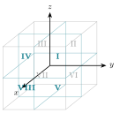
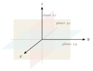
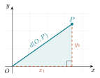
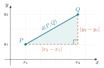
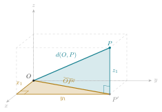
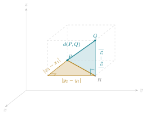

# Sistemas de coordenadas {#sec-coordenadas}

::: {.callout-note appearance="simple"}
**Unidad 1 del curso.** Semana 1, con secciones que se retoman en las semanas 2 y 3.
:::

## El método de Descartes

En 1637, como apéndice de su *Discurso del método*, René Descartes publicó *La Géométrie*. La idea que contiene se ha vuelto tan familiar que cuesta ver lo audaz que fue: **asignar números a los puntos del plano** para poder tratar problemas de figuras con las herramientas del álgebra.

Antes de eso, la geometría griega demostraba que dos rectas se cortan en un punto trazándolas. Después de Descartes, se demuestra resolviendo un sistema de ecuaciones. Los dos caminos son legítimos, pero el segundo tiene una ventaja decisiva: **se puede calcular**, y calcular es algo que se puede hacer sin ingenio, de forma sistemática y sin miedo a equivocarse por una figura mal dibujada.

::: {.callout-note collapse="true" title="Nota histórica — Dos inventores y un apéndice"}
La historia es más curiosa de lo que sugiere el nombre "plano cartesiano". La idea la tuvieron **dos personas, por separado y casi al mismo tiempo**: Descartes la publicó en 1637, pero Pierre de **Fermat** (el mismo del famoso "último teorema") la había desarrollado unos años antes en un manuscrito (*Ad locos planos et solidos isagoge*) que circuló entre matemáticos y sólo se imprimió tras su muerte. Como Descartes publicó primero, el plano lleva su nombre: *cartesiano* viene de **Cartesius**, la forma latinizada de Descartes.

Y hay otra sorpresa: *La Géométrie* no usa ejes perpendiculares fijos como los nuestros, ni la pareja $(x,y)$ tal como la escribimos. La maquinaria que usamos hoy (ejes, cuadrantes, la notación) se fue puliendo durante el siglo siguiente, en buena parte gracias a **Euler**. Lo que Descartes y Fermat aportaron fue la idea de fondo: que una curva puede *ser* una ecuación.
:::

Lo que hace un sistema de coordenadas, dicho con precisión, es establecer una **correspondencia biunívoca** entre los puntos de una figura geométrica y las parejas (o ternas) de números reales. Esa correspondencia es un **diccionario**, y como todo diccionario, permite traducir en las dos direcciones:

| Objeto geométrico | Objeto algebraico |
|---|---|
| Un punto | Una pareja $(x,y)$ |
| Una curva | Una ecuación en $x$ e $y$ |
| "Estas dos rectas se cortan" | "Este sistema tiene solución" |
| "Estos tres puntos son colineales" | "Este determinante vale cero" |

::: {.callout-tip title="La pregunta que vale la pena hacerse todo el semestre"}
Cada vez que aparezca un objeto nuevo, pregúntate cuál es su **traducción** al otro idioma. Y cada vez que resuelvas algo con álgebra, pregúntate **qué significa geométricamente** el resultado. Ese ir y venir es, literalmente, el contenido del curso.
:::

## Localización: la recta, el plano, el espacio

### La recta real

Si fijamos en una recta un punto llamado **origen**, un **sentido** positivo y una **unidad de longitud**, cada punto queda identificado por un número real y cada número real determina un punto. Es la primera correspondencia biunívoca, y la más simple.

### El plano

Dos rectas perpendiculares que se cortan en un origen común (los **ejes**) dividen el plano en cuatro **cuadrantes** y permiten localizar cualquier punto con una pareja ordenada $(x,y)$. La primera coordenada es la **abscisa** y la segunda la **ordenada**.

Que la pareja sea *ordenada* no es un tecnicismo: $(3,5)$ y $(5,3)$ son puntos distintos. El conjunto de todas esas parejas se denota
$$
\mathbb{R}^2=\{(x,y): x\in\mathbb{R},\ y\in\mathbb{R}\}.
$$

::: {.callout-note collapse="true" title="Nota al margen — De dónde vienen «abscisa» y «ordenada»"}
Las dos palabras son latín de taller geométrico. *Abscisa* viene de **linea abscissa**, "línea cortada": el tramo que la coordenada corta sobre el eje horizontal. *Ordenada* viene de **linea ordinatim applicata**, "línea aplicada ordenadamente": los segmentos paralelos que se levantan, en orden, desde el eje hasta la curva. Los términos ya se usaban en el estudio de las cónicas *antes* de Descartes; el plano cartesiano los heredó y los volvió coordenadas.
:::

### El espacio

Con tres ejes mutuamente perpendiculares, cada punto queda determinado por una terna $(x,y,z)$, y el espacio se denota $\mathbb{R}^3$. Los tres planos coordenados ($XY$, $XZ$, $YZ$) dividen el espacio en ocho **octantes**. Los cuatro de arriba se numeran del I al IV siguiendo a los cuadrantes del plano $XY$, y los cuatro de abajo, del V al VIII, quedan justo debajo de ellos.

{width=52% fig-align="center"}

Usaremos siempre el sistema **derecho**, aquel en el que, si los dedos de la mano derecha giran del eje $X$ al eje $Y$, el pulgar apunta en el sentido positivo del eje $Z$. La orientación tendrá consecuencias reales cuando lleguemos al producto cruz.

Al dibujar conservamos siempre la misma vista, para no tener que reinterpretar cada figura. El eje $X$ apunta hacia quien mira, el eje $Y$ hacia la derecha y el eje $Z$ hacia arriba (sus partes positivas). Un modo rápido de ubicarse es mirar la esquina del salón donde se juntan dos paredes y el piso: las tres aristas que salen de ella son los tres ejes.

Para dibujar un punto conviene **puntear su trayectoria** desde el origen, es decir, las unidades que avanzamos al frente, las que avanzamos a la derecha o a la izquierda y las que subimos. Sin esas líneas la perspectiva engaña; con ellas cualquiera puede reconstruir dónde vive el punto.

::: {.callout-warning title="Un error muy frecuente al dibujar en el espacio"}
En el papel, el espacio se representa en perspectiva, y eso hace que dos puntos que se ven cerca puedan estar lejísimos. **La figura en $\mathbb{R}^3$ orienta, pero no decide nada.** En el espacio, más que en el plano, hay que confiar en el cálculo y usar el dibujo sólo como guía.
:::

::: {.callout-tip title="Conviene girar la figura"}
En [geogebra.org/3d](https://www.geogebra.org/3d) la escena se gira con el ratón. Ver el mismo punto desde varias perspectivas es la manera más rápida de dejar de confiar en una sola vista.
:::

### Los planos coordenados y sus ecuaciones

Cada plano coordenado se describe con una ecuación de una sola variable, por el mismo razonamiento que en el plano hace del eje $X$ la recta $y=0$.

{width=52% fig-align="center"}

| Plano coordenado | Ecuación | Descripción |
|---|---|---|
| plano $xy$ | $z=0$ | los puntos de altura cero |
| plano $xz$ | $y=0$ | contiene a los ejes $x$ y $z$ |
| plano $yz$ | $x=0$ | contiene a los ejes $y$ y $z$ |

Los planos **paralelos** a los coordenados se describen igual. Los puntos con $y=3$ forman el plano paralelo al $xz$ que pasa por $(0,3,0)$, y los puntos con $z=-2$ forman el plano paralelo al $xy$, dos unidades abajo. La variable que no aparece en la ecuación es la que queda libre, y aquí quedan libres dos.

Si imponemos **dos** condiciones a la vez, por ejemplo $y=3$ y $z=2$, el resultado es una **recta** paralela al eje $x$, la intersección de dos planos. Cada ecuación recorta un grado de libertad, y a ese conteo volveremos al final del capítulo.

::: {.callout-important title="La misma ecuación, objetos distintos"}
En $\mathbb{R}^2$ la ecuación $x=0$ deja libre una variable y describe una **recta**, el eje $Y$. En $\mathbb{R}^3$ la misma ecuación deja libres dos variables y describe un **plano**, el plano $yz$. Antes de responder qué describe una ecuación hay que saber dónde viven los puntos.
:::

## Puntos y vectores {#sec-punto-vector}

Ésta es la sección más importante del capítulo, y probablemente la que más rinde en todo el semestre. La idea es sencilla de enunciar y sorprendentemente fácil de olvidar:

> Un **punto** es un lugar. Un **vector** es un desplazamiento.

Ambos se escriben como parejas de números, y ahí empieza la confusión. Pero son objetos de naturaleza distinta y no se pueden combinar de cualquier manera.

::: {#def-punto-vector}
## Operaciones legítimas

Sean $P$ y $Q$ puntos, y $u$, $v$ vectores. Entonces:

- $Q-P$ es un **vector**: el desplazamiento que lleva de $P$ a $Q$. Se escribe también $\vec{PQ}$.
- $P+v$ es un **punto**: el resultado de desplazar $P$ según $v$.
- $u+v$ y $\lambda u$ son **vectores**.
- $P+Q$ **no está definido**.
:::

La última línea suele producir incomodidad, así que vale la pena justificarla. Piensa en dos ciudades: Hermosillo y Guaymas. "El desplazamiento de Hermosillo a Guaymas" tiene un significado claro, independiente de dónde pongamos el origen del mapa. "Hermosillo más Guaymas", en cambio, no significa nada: no hay ninguna ciudad que sea su suma. Y si insistiéramos en calcularla sumando coordenadas, el resultado **dependería de dónde pusimos el origen**, lo cual delata que no es un objeto geométrico.

::: {.callout-important title="Elegir un origen es una decisión, no un hecho"}
Cuando fijamos un origen $O$, cada punto $P$ queda asociado al vector $\vec{OP}$, y a partir de ahí es tentador tratarlos como lo mismo. Es cómodo y lo haremos constantemente. Pero conviene recordar que esa identificación **la elegimos nosotros**: la geometría no la trae puesta.

Esta distinción reaparecerá con fuerza en Álgebra Lineal I, el semestre que entra, cuando se pregunten por qué las traslaciones no son transformaciones lineales. La respuesta está aquí.
:::

### El punto medio, bien escrito

Todo el mundo sabe que el punto medio de $P$ y $Q$ es $\tfrac12(P+Q)$. Pero acabamos de decir que $P+Q$ no está definido. ¿Contradicción?

No: es cuestión de escribirlo bien. El punto medio es
$$
M \;=\; P+\tfrac{1}{2}\,(Q-P),
$$
que se lee *"parto de $P$ y avanzo la mitad del desplazamiento hacia $Q$"*. Aquí todo es legítimo: $Q-P$ es un vector, la mitad de un vector es un vector, y punto más vector es punto. Si desarrollas la expresión obtienes las mismas coordenadas de siempre, pero ahora sabes **por qué** funcionan.

Ese mismo argumento da, sin esfuerzo adicional, el punto que divide al segmento en cualquier razón:
$$
P + t\,(Q-P), \qquad t\in[0,1].
$$

Cuando $t$ recorre todos los reales, y no sólo $[0,1]$, esta expresión describe **toda la recta** que pasa por $P$ y $Q$. Volveremos a ella en el capítulo siguiente; conviene que la reconozcas cuando aparezca.

### Figura interactiva

Arrastra los puntos $P$ y $Q$ y observa el vector $Q-P$. **Antes de arrastrar, predice:** si mueves $P$ y $Q$ *juntos*, ¿cambia el vector? ¿Y si sólo mueves uno?

```{=html}
<iframe src="applets/punto-y-vector.html" width="100%" height="470"
        style="border:1px solid #dfe6ee;border-radius:8px" loading="lazy"
        title="Applet: puntos y vectores en el plano"></iframe>
```

::: {.callout-note collapse="true" title="¿Qué debiste observar?"}
Si trasladas $P$ y $Q$ la misma cantidad, el vector $Q-P$ **no cambia**: un desplazamiento no depende de dónde empiece, sólo de su magnitud y su dirección. Si mueves sólo uno, cambia. Esa invariancia es exactamente lo que distingue a un vector de un punto.
:::

## Distancia entre dos puntos

Construimos la fórmula en dos tiempos. Primero medimos desde el origen, donde el triángulo rectángulo aparece de inmediato, y después movemos ese mismo triángulo a una posición cualquiera.

### Del origen a un punto

Si $P=(x_1,y_1)$ está en el primer cuadrante, el segmento $OP$ es la hipotenusa de un triángulo rectángulo cuyos catetos son las coordenadas mismas de $P$. El cateto horizontal está sobre el eje $X$ y mide $x_1$, el vertical mide $y_1$, y el ángulo recto está en $(x_1,0)$.

{width=58% fig-align="center"}

Por el teorema de Pitágoras,
$$
d(O,P)=\sqrt{x_1^{\,2}+y_1^{\,2}} .
$$

En los demás cuadrantes el razonamiento es igual, con catetos $\lvert x_1\rvert$ y $\lvert y_1\rvert$. Los valores absolutos desaparecen al elevar al cuadrado, y por eso no aparecen en la fórmula.

### El mismo triángulo, fuera del origen

Cuando ninguno de los dos puntos está en el origen, trasladamos el triángulo hasta que el vértice del ángulo recto quede en $(x_2,y_1)$. Los catetos dejan de ser coordenadas y pasan a ser **diferencias de coordenadas**.

{width=62% fig-align="center"}

### La misma construcción en el espacio

En el espacio conviene imaginar la **caja** que tiene a los dos puntos como vértices opuestos y las aristas paralelas a los ejes. El segmento que queremos medir es su diagonal, y para medirla aparecen dos triángulos rectángulos.

Empezamos otra vez desde el origen, con $P=(x_1,y_1,z_1)$ y su proyección $P'=(x_1,y_1,0)$ sobre el plano $XY$.

{width=62% fig-align="center"}

- El **triángulo del piso** tiene catetos $\lvert x_1\rvert$ y $\lvert y_1\rvert$, vive en el plano $XY$ y su hipotenusa mide $\overline{OP'}=\sqrt{x_1^{\,2}+y_1^{\,2}}$.
- El **triángulo vertical** tiene catetos $\overline{OP'}$ y $\lvert z_1\rvert$, vive en el plano vertical que contiene a $O$, $P'$ y $P$, y su hipotenusa es $d(O,P)$.

El segundo triángulo toma como cateto la hipotenusa del primero, de modo que
$$
d(O,P)^2=\overline{OP'}^{\,2}+z_1^{\,2}=x_1^{\,2}+y_1^{\,2}+z_1^{\,2}.
$$

Para dos puntos cualesquiera sacamos la caja del rincón del origen y la colocamos en otro lugar, igual que trasladamos el triángulo en el plano. Con $P=(x_1,y_1,z_1)$ y $Q=(x_2,y_2,z_2)$, el vértice auxiliar es $R=(x_2,y_2,z_1)$, la proyección de $Q$ sobre el piso que pasa por $P$.

{width=66% fig-align="center"}

Las aristas de la caja miden ahora $\lvert x_2-x_1\rvert$, $\lvert y_2-y_1\rvert$ y $\lvert z_2-z_1\rvert$. La cuenta es la misma de antes, con diferencias de coordenadas en lugar de coordenadas.

::: {#thm-distancia}
## Distancia entre dos puntos

Si $P=(x_1,y_1)$ y $Q=(x_2,y_2)$ son puntos del plano, la distancia entre ellos es
$$
d(P,Q)=\sqrt{(x_2-x_1)^2+(y_2-y_1)^2}.
$$
En el espacio, con $P=(x_1,y_1,z_1)$ y $Q=(x_2,y_2,z_2)$,
$$
d(P,Q)=\sqrt{(x_2-x_1)^2+(y_2-y_1)^2+(z_2-z_1)^2}.
$$
:::

::: {.proof}
En el plano, los catetos del triángulo trasladado miden $\lvert x_2-x_1\rvert$ y $\lvert y_2-y_1\rvert$, y su hipotenusa es el segmento $PQ$, así que el teorema de Pitágoras da
$$
d(P,Q)^2=\lvert x_2-x_1\rvert^2+\lvert y_2-y_1\rvert^2=(x_2-x_1)^2+(y_2-y_1)^2 ,
$$
y tomamos la raíz positiva porque una distancia no es negativa.

En el espacio aplicamos el mismo teorema dos veces, como en la construcción anterior. El triángulo del piso, de catetos $\lvert x_2-x_1\rvert$ y $\lvert y_2-y_1\rvert$, da $\overline{PR}^{\,2}=(x_2-x_1)^2+(y_2-y_1)^2$. El triángulo vertical, de catetos $\overline{PR}$ y $\lvert z_2-z_1\rvert$, da
$$
d(P,Q)^2=\overline{PR}^{\,2}+(z_2-z_1)^2=(x_2-x_1)^2+(y_2-y_1)^2+(z_2-z_1)^2 . \qquad\square
$$
:::

Vale la pena notar dos cosas. La primera es que **la fórmula no es una definición**, es una consecuencia de Pitágoras, es decir, de la geometría euclidiana. La segunda es que la fórmula sólo tiene esa forma porque los ejes son **perpendiculares** y las unidades **iguales** en ambos. Con ejes oblicuos la distancia se calcula de otro modo.

Conviene además revisar los casos límite, que siempre son una buena prueba de que una fórmula está bien escrita. Si $P$ es el origen, entonces $x_1=y_1=z_1=0$ y recuperamos la distancia desde el origen. Si $z_1=z_2$, el tercer sumando se anula y recuperamos la fórmula del plano.

::: {.callout-note collapse="true" title="Nota histórica — Un teorema más viejo que Pitágoras"}
El teorema que sostiene toda esta sección es bastante más antiguo que el personaje que le da nombre. Una tablilla babilónica de arcilla conocida como **Plimpton 322**, escrita alrededor del año 1800 a.C. (unos doce siglos antes de Pitágoras), contiene una lista de ternas de números que cumplen $a^2+b^2=c^2$, como $(3,4,5)$ y otras mucho menos obvias. Los babilonios conocían la *relación*; la tradición griega aportó lo que convierte una observación en teorema, la **demostración**. Esa diferencia, saber que algo funciona contra saber *por qué* funciona, es exactamente la que este curso quiere que aprendas a distinguir.
:::

### La distancia es la norma de un vector

Observa que si escribimos $v=Q-P=(x_2-x_1,\,y_2-y_1)$, entonces
$$
d(P,Q)=\sqrt{v_1^2+v_2^2}=\lVert v\rVert .
$$

Esto no es una coincidencia ni una notación alternativa: **la distancia entre dos puntos es la longitud del desplazamiento que lleva de uno a otro**. En cuanto lo veas así, la fórmula deja de ser algo que memorizar.

### Tres propiedades de la distancia

Para cualesquiera puntos $P$, $Q$ y $R$ se cumple:

1. $d(P,Q)\ \ge\ 0$, y $d(P,Q)=0$ si y sólo si $P=Q$.
2. $d(P,Q)=d(Q,P)$, la **simetría**.
3. $d(P,Q)\ \le\ d(P,R)+d(R,Q)$, la **desigualdad del triángulo**.

Las tres son creíbles antes de calcular nada. Una longitud no puede ser negativa, y la única manera de recorrer distancia cero es no moverse. El camino de ida mide lo mismo que el de vuelta. Y pasar por un punto intermedio $R$ no puede *acortar* el trayecto de $P$ a $Q$; en el mejor de los casos lo iguala, exactamente cuando $R$ está en el segmento $PQ$.

Las dos primeras se verifican en un renglón. Una raíz de suma de cuadrados nunca es negativa, y vale cero únicamente cuando todos los cuadrados son cero, es decir cuando las coordenadas coinciden una a una. Y como $(x_2-x_1)^2=(x_1-x_2)^2$, elevar al cuadrado elimina el signo y intercambiar $P$ con $Q$ no cambia el valor.

En el espacio las verificaciones son las mismas, con un sumando más. Esa es la ventaja de construir $\mathbb{R}^3$ en paralelo con $\mathbb{R}^2$: casi nada se demuestra otra vez, basta revisar que el argumento anterior siga funcionando con una coordenada más.

La tercera propiedad es la única que pide trabajo, y para ella conviene tener antes el producto punto.

::: {#thm-triangulo}
## Desigualdad del triángulo

Para cualesquiera puntos $P$, $Q$, $R$:
$$
d(P,Q)\ \le\ d(P,R)+d(R,Q),
$$
con igualdad si y sólo si $R$ pertenece al segmento $PQ$.
:::

::: {.proof}
Escribiendo $u=R-P$ y $v=Q-R$, se tiene $Q-P=u+v$, de modo que el enunciado equivale a
$$
\lVert u+v\rVert \le \lVert u\rVert+\lVert v\rVert .
$$
Elevando al cuadrado, y usando que $\lVert w\rVert^2=\langle w,w\rangle$ (que veremos en @sec-producto-punto),
$$
\lVert u+v\rVert^2=\lVert u\rVert^2+2\langle u,v\rangle+\lVert v\rVert^2 ,
$$
mientras que
$$
(\lVert u\rVert+\lVert v\rVert)^2=\lVert u\rVert^2+2\lVert u\rVert\lVert v\rVert+\lVert v\rVert^2 .
$$
Basta entonces con que $\langle u,v\rangle\le\lVert u\rVert\lVert v\rVert$, que es inmediato de @thm-producto-angulo porque $\cos\theta\le 1$. La igualdad ocurre exactamente cuando $\cos\theta=1$, es decir, cuando $u$ y $v$ apuntan en el mismo sentido, o sea cuando $R$ está entre $P$ y $Q$. $\square$
:::

::: {.callout-note appearance="simple"}
Esta demostración usa un resultado de la sección siguiente. No es circular, porque @thm-producto-angulo no usa la desigualdad del triángulo, pero conviene leer ambas secciones antes de darla por entendida.
:::

## El producto punto y el ángulo {#sec-producto-punto}

Aquí aparece la herramienta que sostiene el resto del curso.

::: {#def-producto-punto}
## Producto punto

Para $u=(u_1,u_2)$ y $v=(v_1,v_2)$ en el plano,
$$
\langle u,v\rangle \;=\; u_1v_1+u_2v_2 .
$$
En el espacio se añade el término correspondiente: $\langle u,v\rangle=u_1v_1+u_2v_2+u_3v_3$.
:::

De la definición se siguen de inmediato tres propiedades, todas verificables en un renglón:

1. **Simetría:** $\langle u,v\rangle=\langle v,u\rangle$.
2. **Linealidad:** $\langle \lambda u+w,\,v\rangle=\lambda\langle u,v\rangle+\langle w,v\rangle$.
3. **Positividad:** $\langle u,u\rangle=u_1^2+u_2^2=\lVert u\rVert^2\ \ge 0$, con igualdad sólo si $u=0$.

La tercera es la que conecta el producto punto con la longitud: $\lVert u\rVert=\sqrt{\langle u,u\rangle}$.

::: {#thm-producto-angulo}
## El producto punto mide ángulos

Si $u$ y $v$ son vectores no nulos y $\theta\in[0,\pi]$ es el ángulo entre ellos, entonces
$$
\langle u,v\rangle=\lVert u\rVert\,\lVert v\rVert\cos\theta .
$$
:::

::: {.proof}
Coloca $u$ y $v$ con el mismo origen. El tercer lado del triángulo que forman es el vector $v-u$, y la **ley de cosenos** da
$$
\lVert v-u\rVert^2=\lVert u\rVert^2+\lVert v\rVert^2-2\lVert u\rVert\lVert v\rVert\cos\theta .
$$
Por otro lado, desarrollando con las propiedades del producto punto,
$$
\lVert v-u\rVert^2=\langle v-u,\,v-u\rangle=\lVert v\rVert^2-2\langle u,v\rangle+\lVert u\rVert^2 .
$$
Igualando las dos expresiones y cancelando $\lVert u\rVert^2+\lVert v\rVert^2$ queda
$$
-2\langle u,v\rangle=-2\lVert u\rVert\lVert v\rVert\cos\theta ,
$$
de donde se sigue el resultado. □
:::

Dos consecuencias que usaremos sin parar:

::: {.callout-tip title="Perpendicularidad"}
Como $\cos\theta=0$ exactamente cuando $\theta=\pi/2$:
$$
u\perp v \iff \langle u,v\rangle=0 .
$$
Comprobar que dos vectores son perpendiculares se reduce a una multiplicación y una suma. Es difícil exagerar lo útil que resulta.
:::

Y despejando el coseno,
$$
\cos\theta=\frac{\langle u,v\rangle}{\lVert u\rVert\,\lVert v\rVert},
$$
lo que permite calcular **cualquier** ángulo entre objetos rectilíneos (rectas, planos, aristas) sin transportador y sin trigonometría adicional.

## Inclinación, pendiente y ángulo entre rectas

La **inclinación** de una recta no vertical es el ángulo $\alpha\in[0,\pi)$ que forma con el semieje positivo de las $x$, medido en sentido contrario a las manecillas. Su **pendiente** es $m=\tan\alpha$.

Si la recta pasa por $P=(x_1,y_1)$ y $Q=(x_2,y_2)$ con $x_1\ne x_2$, el vector $Q-P=(x_2-x_1,\,y_2-y_1)$ apunta en su dirección, y por tanto
$$
m=\frac{y_2-y_1}{x_2-x_1}.
$$
La pendiente es, entonces, **la razón entre las dos componentes del vector director**. Las rectas verticales no tienen pendiente precisamente porque esa razón no está definida; en cambio, sí tienen vector director $(0,1)$, lo cual es un primer indicio de que el lenguaje vectorial es más robusto que el de pendientes.

Para el ángulo entre dos rectas hay dos caminos, y conviene conocer los dos:

**Con vectores directores.** Si $d_1$ y $d_2$ son vectores directores de las rectas,
$$
\cos\theta=\frac{\lvert\langle d_1,d_2\rangle\rvert}{\lVert d_1\rVert\,\lVert d_2\rVert}
$$
(el valor absoluto selecciona el ángulo agudo entre las dos rectas). Este método **nunca falla**: funciona también con rectas verticales y en el espacio.

**Con pendientes.** Si las rectas tienen pendientes $m_1$ y $m_2$ y no son perpendiculares,
$$
\tan\theta=\left\lvert\frac{m_2-m_1}{1+m_1m_2}\right\rvert .
$$
Es la fórmula clásica, cómoda cuando ya tienes las pendientes a la mano, pero exige tratar aparte los casos vertical y perpendicular.

::: {.callout-note collapse="true" title="Paralelismo y perpendicularidad, en los dos lenguajes"}
| | Con pendientes | Con vectores |
|---|---|---|
| Paralelas | $m_1=m_2$ | $d_1=\lambda d_2$ |
| Perpendiculares | $m_1m_2=-1$ | $\langle d_1,d_2\rangle=0$ |

La condición $m_1m_2=-1$ falla cuando una recta es vertical y la otra horizontal, aunque sean perpendiculares. La condición $\langle d_1,d_2\rangle=0$ no falla nunca. Conviene saber esto antes de un examen.
:::

## Lugares geométricos

Llegamos al concepto que da nombre a buena parte del curso.

::: {#def-lugar}
## Lugar geométrico

Un **lugar geométrico** es el conjunto de todos los puntos que cumplen una condición dada, y solamente ellos.
:::

Las dos palabras que hacen el trabajo son *"todos"* y *"solamente"*. Cuando afirmamos que cierta ecuación describe un lugar geométrico, estamos afirmando dos cosas a la vez:

1. Todo punto que cumple la condición satisface la ecuación.
2. Todo punto que satisface la ecuación cumple la condición.

Saltarse la segunda es el error clásico. Cuando elevamos al cuadrado, por ejemplo, podemos introducir soluciones que no cumplían la condición original.

### El procedimiento, en cuatro pasos

Traducir una condición verbal a una ecuación siempre sigue el mismo esquema:

1. Llama $P=(x,y)$ al punto genérico que cumple la condición.
2. Escribe la condición como una igualdad entre distancias, ángulos o áreas.
3. Sustituye cada elemento por su expresión en coordenadas.
4. Simplifica, cuidando de no perder ni ganar soluciones.

### Ejemplo trabajado

> **Halla el lugar geométrico de los puntos que equidistan de $A=(-2,1)$ y $B=(4,3)$.**

*Paso 1.* Sea $P=(x,y)$ un punto cualquiera del lugar.

*Paso 2.* La condición es $d(P,A)=d(P,B)$.

*Paso 3.* En coordenadas,
$$
\sqrt{(x+2)^2+(y-1)^2}=\sqrt{(x-4)^2+(y-3)^2}.
$$

*Paso 4.* Ambos lados son no negativos, así que elevar al cuadrado es una operación reversible aquí y no introduce soluciones falsas:
$$
(x+2)^2+(y-1)^2=(x-4)^2+(y-3)^2 .
$$
Desarrollando,
$$
x^2+4x+4+y^2-2y+1 \;=\; x^2-8x+16+y^2-6y+9 ,
$$
y cancelando $x^2$ e $y^2$,
$$
4x+5-2y=-8x+25-6y \;\Longrightarrow\; 12x+4y-20=0 \;\Longrightarrow\; 3x+y-5=0 .
$$

El lugar es una **recta**. Y no cualquiera: es la mediatriz del segmento $AB$. Vale la pena comprobar dos cosas que la geometría predice y el álgebra debe confirmar: que el punto medio $M=(1,2)$ satisface la ecuación, y que el vector $(3,1)$, formado por los coeficientes de la ecuación, es paralelo a $B-A=(6,2)$, es decir, **perpendicular a la recta**.

::: {.callout-important title="Ese último hecho no es casualidad"}
Los coeficientes de $x$ e $y$ en la ecuación general de una recta forman un vector **perpendicular** a ella. Es uno de los resultados que más rendimiento dan en todo el curso, y lo desarrollaremos en el @sec-recta. Si lo ves aquí por primera vez, guárdalo.
:::

## Curvas y superficies: qué esperar

Terminamos con un mapa de lo que viene, porque ayuda a saber dónde se está parado.

En el plano, una ecuación $F(x,y)=0$ describe normalmente una **curva**: una condición sobre dos variables deja un grado de libertad. En el espacio, una ecuación $F(x,y,z)=0$ describe normalmente una **superficie**: una condición sobre tres variables deja dos grados de libertad.

De ahí se sigue algo que suele sorprender: **una curva en el espacio necesita dos ecuaciones**, no una. Una sola ecuación no puede recortar el espacio hasta dejar sólo una dimensión.

| En $\mathbb{R}^2$ | En $\mathbb{R}^3$ |
|---|---|
| $F(x,y)=0$ → una curva | $F(x,y,z)=0$ → una superficie |
| Punto: dos ecuaciones | Curva: dos ecuaciones |
| | Punto: tres ecuaciones |

Este conteo de grados de libertad (que en su versión formal se llama *codimensión*) explicará más adelante por qué una recta en el espacio se describe con dos planos o con una parametrización, pero nunca con una sola ecuación lineal. No es un capricho de la notación: es aritmética de dimensiones.

---

## Ejercicios {.unnumbered}

### De la condición a la ecuación {.unnumbered}

**1.1** Halla el lugar geométrico de los puntos cuya distancia al punto $(3,0)$ es igual a $5$.

**1.2** Halla el lugar geométrico de los puntos que equidistan de $(0,4)$ y del eje $X$.

**1.3** Halla el lugar geométrico de los puntos $P$ tales que la suma de sus distancias a $(-3,0)$ y $(3,0)$ vale $10$. Simplifica todo lo que puedas. (Aparecerá otra vez en el capítulo de cónicas; guarda tu resultado.)

**1.4** Un segmento de longitud $6$ se desliza de modo que un extremo permanece sobre el eje $X$ y el otro sobre el eje $Y$. Halla el lugar geométrico que describe su punto medio.

### De la ecuación a la figura {.unnumbered}

**1.5** Describe con palabras, sin graficar, el lugar geométrico $x^2+y^2-6x+8y=0$. ¿Pasa por el origen?

**1.6** ¿Qué representa la ecuación $(x-1)^2+(y+2)^2=0$? ¿Y $(x-1)^2+(y+2)^2=-4$? Justifica.

**1.7** Describe el conjunto de $\mathbb{R}^3$ dado por $z=2$. ¿Y el dado por $x=0$ **y** $z=2$?

**1.8** ¿En qué octante vive cada uno de los puntos $(1,2,3)$, $(2,-1,3)$ y $(-1,-2,-3)$? ¿Y dónde vive $(0,0,5)$?

**1.9** Escribe la ecuación del plano paralelo al plano $xz$ que pasa por $(0,-4,0)$, y la del plano paralelo al $xy$ que pasa por $(0,0,7)$.

### Puntos, vectores y distancia {.unnumbered}

**1.10** Sean $P=(1,-2)$, $R=(5,1)$ y $Q=(-3,4)$.

a. Calcula $R-P$ y $Q-R$. Verifica que $(R-P)+(Q-R)=Q-P$ y explica geométricamente por qué debía salir eso.
b. Calcula $d(P,R)$, $d(R,Q)$ y $d(P,Q)$, y comprueba la desigualdad del triángulo.
c. Halla el punto medio de $PQ$ escribiéndolo en la forma $P+t(Q-P)$.

**1.11** Determina si el triángulo de vértices $A=(0,0)$, $B=(4,2)$, $C=(1,5)$ tiene algún ángulo recto. Hazlo con productos punto y explica qué calculaste exactamente.

**1.12** Halla un valor de $k$ para el cual los vectores $(2,k)$ y $(k+1,3)$ sean perpendiculares. ¿Hay más de uno?

**1.13** Calcula $d\bigl(O,(2,6,3)\bigr)$ y $d\bigl((2,-1,3),(0,1,2)\bigr)$. En los dos casos el resultado es un entero; identifica los dos triángulos rectángulos que intervienen en el primero.

**1.14** Demuestra que los puntos $(1,1)$, $(4,2)$ y $(7,3)$ son colineales, de dos maneras distintas: con pendientes y con vectores. ¿Cuál de las dos seguiría funcionando si los puntos estuvieran en $\mathbb{R}^3$?

### Para pensar despacio {.unnumbered}

**1.15** Explica, con tus palabras y en no más de media página, por qué $P+Q$ no está definido para puntos pero $P+v$ sí lo está para un punto y un vector. Incluye un ejemplo que muestre qué sale mal si se insiste en sumar dos puntos.

**1.16** Demuestra que en cualquier triángulo, el segmento que une los puntos medios de dos lados es paralelo al tercer lado y mide la mitad. Usa vectores: la demostración cabe en tres renglones y no requiere ninguna figura.

**1.17** La desigualdad del triángulo dice que $d(P,Q)\le d(P,R)+d(R,Q)$. Enuncia con precisión en qué caso se da la igualdad y demuéstralo a partir de @thm-producto-angulo.
