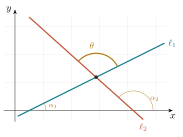
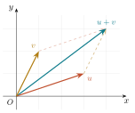
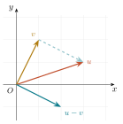
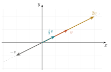
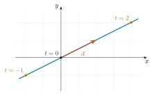
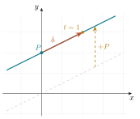

# Vectores y la recta en el plano {#sec-recta}

::: {.callout-note appearance="simple"}
**Unidad 2 del temario.** La recta en el plano, tratada con vectores.
:::

::: {.callout-tip title="Objetivos del capítulo"}
- Escribir la ecuación de una recta del plano en **forma paramétrica**, $X=P+t\,d$. Es el objetivo principal del capítulo: de todas las formas de la ecuación de una recta, es la única que no depende de la pendiente y, por eso, la única que se generaliza al espacio y, en general, a $\mathbb{R}^n$.
- Distinguir un **punto** de un **vector** y operar con ellos sin mezclarlos.
- Efectuar las operaciones con vectores —suma, resta y producto por un escalar— e interpretar geométricamente cada una.
- Describir una recta mediante un **punto de paso** y un **vector director**, y reconocer la forma paramétrica como la traslación de una recta que pasa por el origen.
- Reconocer la distancia entre dos puntos como la **norma** de un vector.
- Calcular el **producto punto** y usarlo para medir ángulos y decidir perpendicularidad.
- Demostrar la **desigualdad del triángulo**, resultado que quedó pendiente en @sec-coordenadas.
- Calcular el **ángulo entre dos rectas**, primero con pendientes y después con el producto punto, y reconocer por qué la segunda expresión no tiene excepciones.
- Traducir entre las distintas formas de la ecuación de una recta y calcular la distancia de un punto a una recta.
:::

::: {.callout-warning appearance="simple"}
Capítulo en preparación. Las primeras secciones ya están escritas; el resto es el esqueleto que fija el orden y el enfoque, y se completa conforme avanza el curso.
:::

## La recta, en el lenguaje que ya se conoce

Del bachillerato se conocen varias maneras de escribir la ecuación de una recta del plano. Conviene tenerlas a la vista, porque este capítulo empieza justo donde ellas terminan.

| Forma | Expresión | Dato que se lee de inmediato |
|---|---|---|
| Punto--pendiente | $y-y_0=m(x-x_0)$ | un punto de paso y la pendiente |
| Pendiente--ordenada | $y=mx+b$ | la pendiente y el corte con el eje $Y$ |
| General | $Ax+By+C=0$ | en apariencia ninguno; se verá que $A$ y $B$ dicen bastante |
| Simétrica | $\dfrac{x}{a}+\dfrac{y}{b}=1$ | los cortes con los ejes, $(a,0)$ y $(0,b)$ |

Las cuatro dependen, directa o indirectamente, de la **pendiente**, y de ahí vienen sus dos limitaciones: ninguna describe las rectas verticales, y ninguna se generaliza al espacio, donde la dirección de una recta no cabe en un solo número. La forma que falta en esa lista, la **paramétrica**, es la que no tiene ese defecto, y construirla es el objetivo de este capítulo.

### Ejemplo trabajado: la mediatriz

> **Hallar el lugar geométrico de los puntos que equidistan de $A=(-2,1)$ y $B=(4,3)$.**

*Paso 1.* Sea $P=(x,y)$ un punto cualquiera del lugar.

*Paso 2.* La condición es $d(P,A)=d(P,B)$.

*Paso 3.* En coordenadas,
$$
\sqrt{(x+2)^2+(y-1)^2}=\sqrt{(x-4)^2+(y-3)^2}.
$$

*Paso 4.* Ambos lados son no negativos, así que elevar al cuadrado es reversible aquí y no introduce soluciones falsas:
$$
(x+2)^2+(y-1)^2=(x-4)^2+(y-3)^2 .
$$
Desarrollando,
$$
x^2+4x+4+y^2-2y+1 \;=\; x^2-8x+16+y^2-6y+9 ,
$$
y cancelando $x^2$ e $y^2$,
$$
4x+5-2y=-8x+25-6y \;\Longrightarrow\; 12x+4y-20=0 \;\Longrightarrow\; 3x+y-5=0 .
$$

El lugar geométrico es una **recta**, precisamente la mediatriz del segmento $AB$, y la ecuación quedó escrita en forma general. Conviene comprobar un hecho que la geometría anticipa y el álgebra debe confirmar: el punto medio $M=(1,2)$ satisface la ecuación.

::: {.callout-important title="Una observación importante"}
Los coeficientes de $x$ e $y$ en la ecuación general de una recta forman un par de números **perpendicular** a ella. En este ejemplo, el par $(3,1)$ es perpendicular a la mediatriz. Es uno de los resultados de mayor utilidad del curso, y se desarrolla más adelante en este capítulo, al construir el vector normal.
:::


## El ángulo entre dos rectas, con pendientes {#sec-angulo-pendientes}

Cuando dos rectas se cortan determinan dos pares de ángulos suplementarios. Para hablar de *el* ángulo entre ellas se fija un criterio: $\theta$ es el ángulo que se recorre, en sentido contrario al de las manecillas, desde la recta $\ell_1$ hasta la recta $\ell_2$.

{width=44% fig-align="center"}

::: {#thm-angulo-rectas}
## Ángulo entre dos rectas

Si $\ell_1$ y $\ell_2$ tienen pendientes $m_1$ y $m_2$, y no son perpendiculares, el ángulo $\theta$ medido de $\ell_1$ a $\ell_2$ satisface
$$
\tan\theta=\frac{m_2-m_1}{1+m_1m_2}.
$$
:::

::: {.proof}
En el triángulo que forman las dos rectas con el eje $X$, el ángulo exterior es igual a la suma de los interiores no adyacentes, de donde $\alpha_2=\alpha_1+\theta$ y por tanto $\theta=\alpha_2-\alpha_1$. Aplicando la fórmula de la tangente de una diferencia,
$$
\tan\theta=\tan(\alpha_2-\alpha_1)=\frac{\tan\alpha_2-\tan\alpha_1}{1+\tan\alpha_1\tan\alpha_2}=\frac{m_2-m_1}{1+m_1m_2}. \qquad\square
$$
:::

De la fórmula se leen los dos casos extremos. Si las rectas son **paralelas**, entonces $m_1=m_2$, el numerador se anula y $\theta=0$. Si son **perpendiculares**, entonces $\theta=\pi/2$ y la tangente no está definida, lo cual ocurre exactamente cuando el denominador se anula, es decir cuando $m_1m_2=-1$. Ésa es la demostración de la condición de perpendicularidad enunciada antes.

**Ejemplo.** Las rectas de pendientes $m_1=\tfrac12$ y $m_2=-\tfrac95$ forman un ángulo $\theta$ con
$$
\tan\theta=\frac{-\tfrac95-\tfrac12}{1+\bigl(\tfrac12\bigr)\bigl(-\tfrac95\bigr)}=\frac{-\tfrac{23}{10}}{\tfrac{1}{10}}=-23 ,
$$
de donde $\theta\approx 92.5^\circ$. El signo negativo indica que el ángulo medido de $\ell_1$ a $\ell_2$ es obtuso; el ángulo agudo entre las dos rectas mide $180^\circ-92.5^\circ=87.5^\circ$.

::: {.callout-important title="Paralelismo y perpendicularidad"}
Dos rectas no verticales, de pendientes $m_1$ y $m_2$, son **paralelas** si y sólo si $m_1=m_2$, porque tienen la misma inclinación. Son **perpendiculares** si y sólo si
$$
m_1m_2=-1 .
$$
La primera condición se lee directamente de la definición de pendiente; la segunda acaba de obtenerse del teorema anterior. Conviene notar que la condición de perpendicularidad falla cuando una de las rectas es vertical, caso en el que la pendiente no existe aunque la perpendicularidad sí.
:::

::: {.callout-note appearance="simple"}
Esta fórmula exige tratar por separado las rectas verticales, que no tienen pendiente. En @sec-angulo-vectorial se obtiene una expresión equivalente en términos de vectores, que no presenta esa excepción y que además vale en el espacio. Ése es, en pequeño, el argumento de todo el capítulo.
:::

## Puntos y vectores {#sec-punto-vector}

Esta sección introduce la distinción conceptual sobre la que se apoya el resto del curso. La idea es sencilla de enunciar y, sin embargo, se pierde de vista con frecuencia.

> Un **punto** es un lugar. Un **vector** es un desplazamiento.

Ambos se representan como parejas de números, lo cual es origen frecuente de confusión. Se trata, sin embargo, de objetos de naturaleza distinta, que no admiten cualquier combinación.

Un vector $v=(v_1,v_2)$ indica cuánto se avanza en la dirección del eje $X$ y cuánto en la del eje $Y$. Su representación geométrica es una flecha, y conviene precisar desde ahora dónde empieza esa flecha.

::: {.callout-important title="El convenio formal: los vectores están anclados al origen"}
Formalmente, un vector de $\mathbb{R}^2$ es una pareja $(v_1,v_2)$, y su representación geométrica es la flecha que va **del origen** al punto $(v_1,v_2)$. Ése es el objeto con el que opera el Álgebra Lineal, y por eso el espacio vectorial tiene un solo vector cero, la flecha que no sale de $O$.

Cuando esa misma flecha se dibuja con punto inicial en otro lugar, se dibuja una **copia trasladada**, un recurso de representación que los textos de física llaman *vector libre*. El recurso es legítimo porque un desplazamiento no cambia al trasladarse, invariancia que se comprueba en la figura interactiva de este capítulo. El convenio del curso es el formal: al operar, todo vector está anclado al origen; al ilustrar, la flecha se traslada a donde aclare la figura.
:::

::: {.callout-important title="Elegir un origen es una decisión, no un hecho"}
Al fijar un origen $O$, cada punto $P$ queda asociado al vector $\vec{OP}$, y resulta tentador identificarlos. Es una identificación cómoda, que se emplea de manera constante, pero conviene recordar que **proviene de una elección** y no de la geometría misma.

La distinción reaparece en Álgebra Lineal I, al preguntar por qué las traslaciones no son transformaciones lineales. La respuesta se encuentra aquí.
:::

## Las operaciones con vectores {#sec-operaciones-vectores}

Entre vectores están definidas dos operaciones, y ambas se efectúan componente a componente. Su interés no reside en el cálculo, que es inmediato, sino en la lectura geométrica de cada una.

### Suma y resta

Para $u=(u_1,u_2)$ y $v=(v_1,v_2)$,
$$
u+v=(u_1+v_1,\ u_2+v_2),
\qquad
u-v=(u_1-v_1,\ u_2-v_2).
$$

La **suma** compone desplazamientos: se recorre $u$ y, desde su extremo, se recorre $v$; la flecha que cierra el camino es $u+v$. Puesto que el orden de los sumandos no altera el resultado, las dos maneras de recorrer el camino producen el mismo extremo y la figura que se forma es un paralelogramo. De ahí que la construcción reciba indistintamente el nombre de *regla del triángulo* o *regla del paralelogramo*.

{width=40% fig-align="center"}

La **resta** responde a una pregunta que reaparece durante todo el curso: *¿qué desplazamiento lleva de un extremo al otro?* La respuesta es $u-v$, y su copia trasladada va del extremo de $v$ al extremo de $u$. Anclada al origen, es la flecha que le corresponde por convenio.

{width=34% fig-align="center"}

### El producto por un escalar

En este contexto, un número real recibe el nombre de **escalar**, precisamente porque su efecto sobre un vector es de escala. La operación también se define componente a componente,
$$
\lambda\,v=(\lambda v_1,\ \lambda v_2), \qquad \lambda\in\mathbb{R},
$$
y su lectura geométrica es la siguiente:

- si $\lvert\lambda\rvert>1$, la flecha se alarga; si $0<\lvert\lambda\rvert<1$, se acorta;
- si $\lambda<0$, el sentido se invierte;
- si $\lambda=0$, se obtiene el vector cero.

La **dirección** no cambia en ningún caso: todos los múltiplos de un mismo vector no nulo quedan sobre una misma recta que pasa por el origen. Esta observación, que parece menor, es el punto de partida de la descripción vectorial de la recta.

{width=50% fig-align="center"}

::: {.callout-note title="Las propiedades, y hacia dónde conducen"}
Las dos operaciones satisfacen, para todos los vectores $u,v,w$ y todos los escalares $\lambda,\mu$:
$$
u+v=v+u, \qquad (u+v)+w=u+(v+w), \qquad u+0=u, \qquad u+(-u)=0,
$$
$$
\lambda(u+v)=\lambda u+\lambda v, \qquad (\lambda+\mu)u=\lambda u+\mu u, \qquad \lambda(\mu u)=(\lambda\mu)u, \qquad 1\,u=u .
$$
Todas se verifican en un renglón, componente a componente. El conjunto $\mathbb{R}^2$ con estas dos operaciones y estas ocho propiedades constituye el primer ejemplo de **espacio vectorial**, estructura que se estudia con detalle en Álgebra Lineal I. Este curso trabaja en ella sin nombrarla a cada paso.
:::

## Operaciones entre puntos y vectores

Falta precisar qué ocurre cuando puntos y vectores aparecen en una misma expresión.

::: {#def-punto-vector}
## Operaciones legítimas

Sean $P$ y $Q$ puntos, y $u$, $v$ vectores. Entonces:

- $Q-P$ es un **vector**, el desplazamiento que lleva de $P$ a $Q$. Se escribe también $\vec{PQ}$.
- $P+v$ es un **punto**, el resultado de desplazar $P$ según $v$.
- $u+v$ y $\lambda u$ son **vectores**.
- $P+Q$ **no está definido**.
:::

La regla de lectura se resume así: punto menos punto es vector, punto más vector es punto, y punto más punto no significa nada.

La última afirmación requiere justificación. Considérense dos ciudades, Hermosillo y Guaymas. "El desplazamiento de Hermosillo a Guaymas" tiene un significado claro, independiente de dónde se ponga el origen del mapa. "Hermosillo más Guaymas", en cambio, no significa nada, porque no hay ninguna ciudad que sea su suma. Y si se calculara sumando coordenadas, el resultado **dependería del origen elegido**, lo cual muestra que no corresponde a ningún objeto geométrico.

### El punto medio

El punto medio de $P$ y $Q$ suele escribirse $\tfrac12(P+Q)$, expresión que contradice lo anterior, puesto que $P+Q$ no está definido. La contradicción es sólo aparente y se resuelve escribiendo el punto medio como
$$
M \;=\; P+\tfrac{1}{2}\,(Q-P),
$$
que se lee *"partimos de $P$ y avanzamos la mitad del desplazamiento hacia $Q$"*. Todas las operaciones son ahora legítimas, porque $Q-P$ es un vector, la mitad de un vector es un vector, y punto más vector es punto. Al desarrollar la expresión se obtienen las coordenadas habituales, con la ventaja de conocer su justificación.

El mismo argumento proporciona, sin esfuerzo adicional, el punto que divide al segmento en cualquier razón,
$$
P + t\,(Q-P), \qquad t\in[0,1].
$$

Cuando $t$ recorre todos los reales, y no sólo $[0,1]$, esta expresión describe **toda la recta** que pasa por $P$ y $Q$. Es la forma paramétrica de la recta, que se construye con detalle en @sec-parametrica.

### Figura interactiva

La figura permite desplazar los puntos $P$ y $Q$ y observar el vector $Q-P$. **Antes de moverlos conviene anticipar el resultado.** Si $P$ y $Q$ se desplazan la misma cantidad, ¿cambia el vector? ¿Y si se desplaza sólo uno?

```{=html}
<iframe src="applets/punto-y-vector.html" width="100%" height="470"
        style="border:1px solid #dfe6ee;border-radius:8px" loading="lazy"
        title="Applet: puntos y vectores en el plano"></iframe>
```

::: {.callout-note collapse="true" title="Observación"}
Al trasladar $P$ y $Q$ la misma cantidad, el vector $Q-P$ **no cambia**, porque un desplazamiento no depende de su punto de partida, sino sólo de su magnitud y su dirección. Si se desplaza uno solo de los puntos, el vector cambia. Esa invariancia es precisamente lo que distingue a un vector de un punto.
:::

## La distancia es la norma de un vector

Si escribimos $v=Q-P=(x_2-x_1,\,y_2-y_1)$, entonces la fórmula del @thm-distancia se lee
$$
d(P,Q)=\sqrt{v_1^2+v_2^2}=\lVert v\rVert .
$$

No se trata de una coincidencia ni de una notación alternativa. **La distancia entre dos puntos es la longitud del desplazamiento que lleva de uno a otro**, y entendida así la fórmula no requiere memorización.

## La recta descrita con un vector {#sec-parametrica}

Del bachillerato se conoce la recta en la forma $y=mx+b$, donde $m$ es la pendiente y $b$ la ordenada al origen, y en la forma punto--pendiente $y-y_0=m(x-x_0)$. La pendiente se definió en @sec-coordenadas como la tangente de la inclinación. Ya se señaló al abrir el capítulo que esas expresiones comparten dos limitaciones: **no describen las rectas verticales**, que carecen de pendiente, y no se generalizan al espacio, donde una recta no queda determinada por un solo número.

La descripción vectorial no tiene ninguna de las dos limitaciones. Se construye en dos pasos.

### Primer caso: las rectas que pasan por el origen

Sea $d\neq 0$ un vector. Según se observó en @sec-operaciones-vectores, todos sus múltiplos conservan la dirección, de modo que el conjunto
$$
\ell_0:\quad X=t\,d, \qquad t\in\mathbb{R},
$$
está contenido en una recta. Recíprocamente, todo punto de esa recta es un múltiplo de $d$, de manera que la expresión anterior la describe por completo: es la recta que pasa por el origen y por el punto $d$.

Cada valor del parámetro $t$ produce un punto: $t=0$ da el origen, $t=1$ da $d$, y los valores negativos dan los puntos del otro lado.

{width=54% fig-align="center"}

Obsérvese que $d$ puede sustituirse por cualquier otro punto de la recta distinto del origen sin que la recta cambie: el vector director de una recta **no es único**, y dos directores de una misma recta difieren en un factor escalar.

### Segundo caso: cualquier recta

Una recta que no pasa por el origen tiene la misma dirección que una que sí pasa; es esa recta **trasladada**. Y trasladar un conjunto de puntos consiste en sumar a cada uno de ellos un mismo vector, es decir, en fijar un punto $P$ de la recta buscada y desplazar hasta él la recta $\ell_0$.

::: {#def-recta-parametrica}
## Forma paramétrica de la recta

Dados un punto $P$ y un vector $d\neq 0$, la recta que pasa por $P$ con dirección $d$ es el conjunto de puntos
$$
\ell:\quad X = P + t\,d, \qquad t\in\mathbb{R}.
$$
El punto $P$ se llama **punto de paso** y el vector $d$, **vector director** de la recta.
:::

Una recta queda determinada, entonces, por un punto de paso y una dirección. Cada valor de $t$ produce un punto de $\ell$ y, al recorrer $t$ todos los reales, se obtienen todos sus puntos. Todas las operaciones involucradas son legítimas: $t\,d$ es un vector y $P+t\,d$ es un punto.

{width=40% fig-align="center"}

En el lenguaje del bachillerato ocurre exactamente lo mismo: $y=mx$ pasa por el origen y $y=mx+b$ es esa misma recta subida $b$ unidades. La forma paramétrica hace explícita esa traslación y, además, describe también las rectas verticales.

Si la recta se conoce por dos de sus puntos, $P$ y $Q$, un vector director es $d=Q-P$, y se recupera la expresión $X=P+t\,(Q-P)$ obtenida al estudiar el punto medio.

### Pertenencia a una recta

Escribiendo $X=(x,y)$, $P=(x_0,y_0)$ y $d=(d_1,d_2)$, la forma paramétrica equivale al par de **ecuaciones paramétricas**
$$
x=x_0+t\,d_1, \qquad y=y_0+t\,d_2 .
$$
Un punto pertenece a la recta cuando **existe un mismo valor de $t$** que satisface las dos ecuaciones. Éste es el criterio que decide la pertenencia, y el error más frecuente consiste en resolver cada coordenada por separado sin verificar que el parámetro coincida.

::: {.callout-note title="Ejemplo"}
Sea $\ell: X=(1,2)+t\,(3,1)$.

Para $t=0,1,2,-1$ se obtienen los puntos $(1,2)$, $(4,3)$, $(7,4)$ y $(-2,1)$.

El punto $(10,5)$ pertenece a $\ell$: la abscisa exige $1+3t=10$, es decir $t=3$, y con ese mismo valor la ordenada da $2+3=5$.

El punto $(7,5)$ no pertenece: la abscisa exige $t=2$ y la ordenada exige $t=3$. Al no coincidir el parámetro, el punto no está en la recta, aunque cada coordenada por separado sea alcanzable.
:::

### De la dirección a la pendiente

Sea $d=(d_1,d_2)$ un vector director con $d_1\neq 0$. Al avanzar $d_1$ unidades en $x$, la ordenada cambia $d_2$ unidades, de modo que la pendiente de la recta es
$$
m=\frac{d_2}{d_1},
$$
y si la recta pasa por $P=(x_1,y_1)$ y $Q=(x_2,y_2)$, tomando $d=Q-P$ se recupera la expresión conocida $m=\dfrac{y_2-y_1}{x_2-x_1}$.

La pendiente es, por tanto, un caso particular de la noción de dirección: resume en un solo número la información de un vector director, al precio de perder los casos en que $d_1=0$.

::: {.callout-important title="Dónde falla un lenguaje y el otro no"}
Una recta vertical no tiene pendiente, porque la razón $d_2/d_1$ no está definida cuando $d_1=0$. Sí tiene, en cambio, vector director $(0,1)$, y su forma paramétrica no presenta ninguna anomalía. Recíprocamente, si una recta no es vertical y tiene pendiente $m$, entonces $(1,m)$ es un vector director suyo.

El lenguaje vectorial cubre los casos en que el de pendientes falla, y es además el único de los dos que se generaliza al espacio. Por esa razón se adopta como lenguaje principal del curso.
:::

## El giro de noventa grados y el vector normal

El giro $d=(d_1,d_2)\mapsto n=(-d_2,d_1)$, y la comprobación de que $\langle n,d\rangle=0$. La recta como $\langle n,X\rangle=c$, y de ahí por qué los coeficientes de $Ax+By=C$ **son** el vector normal.

## El producto punto y el ángulo {#sec-producto-punto}

Se introduce ahora la herramienta sobre la que se apoya el resto del curso.

::: {#def-producto-punto}
## Producto punto

Para $u=(u_1,u_2)$ y $v=(v_1,v_2)$ en el plano,
$$
\langle u,v\rangle \;=\; u_1v_1+u_2v_2 .
$$
En el espacio se añade el término correspondiente, $\langle u,v\rangle=u_1v_1+u_2v_2+u_3v_3$.
:::

De la definición se siguen de inmediato tres propiedades, todas verificables en un renglón.

1. **Simetría:** $\langle u,v\rangle=\langle v,u\rangle$.
2. **Linealidad:** $\langle \lambda u+w,\,v\rangle=\lambda\langle u,v\rangle+\langle w,v\rangle$.
3. **Positividad:** $\langle u,u\rangle=u_1^2+u_2^2=\lVert u\rVert^2\ \ge 0$, con igualdad sólo si $u=0$.

La tercera es la que conecta el producto punto con la longitud, $\lVert u\rVert=\sqrt{\langle u,u\rangle}$.

::: {#thm-producto-angulo}
## El producto punto mide ángulos

Si $u$ y $v$ son vectores no nulos y $\theta\in[0,\pi]$ es el ángulo entre ellos, entonces
$$
\langle u,v\rangle=\lVert u\rVert\,\lVert v\rVert\cos\theta .
$$
:::

::: {.proof}
Colocamos $u$ y $v$ con el mismo origen. El tercer lado del triángulo que forman es el vector $v-u$, y la **ley de cosenos** da
$$
\lVert v-u\rVert^2=\lVert u\rVert^2+\lVert v\rVert^2-2\lVert u\rVert\lVert v\rVert\cos\theta .
$$
Por otro lado, desarrollando con las propiedades del producto punto,
$$
\lVert v-u\rVert^2=\langle v-u,\,v-u\rangle=\lVert v\rVert^2-2\langle u,v\rangle+\lVert u\rVert^2 .
$$
Igualando las dos expresiones y cancelando $\lVert u\rVert^2+\lVert v\rVert^2$ queda
$$
-2\langle u,v\rangle=-2\lVert u\rVert\lVert v\rVert\cos\theta ,
$$
de donde se sigue el resultado. $\square$
:::

Dos consecuencias de uso constante.

::: {.callout-tip title="Perpendicularidad"}
Como $\cos\theta=0$ exactamente cuando $\theta=\pi/2$,
$$
u\perp v \iff \langle u,v\rangle=0 .
$$
Comprobar que dos vectores son perpendiculares se reduce a dos productos y una suma. Es una de las herramientas de uso más frecuente en el curso.
:::

Y despejando el coseno,
$$
\cos\theta=\frac{\langle u,v\rangle}{\lVert u\rVert\,\lVert v\rVert},
$$
lo que permite calcular **cualquier** ángulo entre objetos rectilíneos (rectas, planos, aristas) sin transportador y sin trigonometría adicional.

## La desigualdad del triángulo, demostrada {#sec-desigualdad-triangulo}

Con el producto punto disponible puede demostrarse el resultado que quedó pendiente en @sec-coordenadas, la tercera propiedad de la distancia.

::: {.proof}
Se trata de demostrar la **desigualdad del triángulo**, la tercera propiedad de la distancia enunciada en @sec-coordenadas. Escribiendo $u=R-P$ y $v=Q-R$, se tiene $Q-P=u+v$, de modo que el enunciado equivale a
$$
\lVert u+v\rVert \le \lVert u\rVert+\lVert v\rVert .
$$
Elevando al cuadrado y usando que $\lVert w\rVert^2=\langle w,w\rangle$,
$$
\lVert u+v\rVert^2=\lVert u\rVert^2+2\langle u,v\rangle+\lVert v\rVert^2 ,
$$
mientras que
$$
(\lVert u\rVert+\lVert v\rVert)^2=\lVert u\rVert^2+2\lVert u\rVert\lVert v\rVert+\lVert v\rVert^2 .
$$
Basta entonces con que $\langle u,v\rangle\le\lVert u\rVert\lVert v\rVert$, que es inmediato del @thm-producto-angulo porque $\cos\theta\le 1$. La igualdad ocurre exactamente cuando $\cos\theta=1$, es decir, cuando $u$ y $v$ apuntan en el mismo sentido, lo que ocurre exactamente cuando $R$ está entre $P$ y $Q$. $\square$
:::

La demostración es válida en el plano y en el espacio, porque en ningún renglón interviene el número de coordenadas. Un solo argumento cubre los dos casos.

## El ángulo entre rectas, con el producto punto {#sec-angulo-vectorial}

Al comienzo de este capítulo el ángulo entre dos rectas se calculó con las pendientes, mediante la fórmula del @thm-angulo-rectas. Esa expresión obliga a tratar por separado las rectas verticales, que no tienen pendiente, y no se generaliza al espacio. El producto punto proporciona una alternativa sin esas limitaciones.

Si $d_1$ y $d_2$ son vectores directores de dos rectas, en el sentido de @def-recta-parametrica, el ángulo agudo $\theta$ entre ellas satisface
$$
\cos\theta=\frac{\lvert\langle d_1,d_2\rangle\rvert}{\lVert d_1\rVert\,\lVert d_2\rVert},
$$
donde el valor absoluto selecciona el ángulo agudo de los dos que las rectas determinan.

Este procedimiento funciona sin excepciones. Una recta vertical carece de pendiente, pero tiene vector director $(0,1)$, y el cálculo procede igual. La misma fórmula, con vectores de tres componentes, dará el ángulo entre rectas del espacio.

::: {.callout-note collapse="true" title="Paralelismo y perpendicularidad, en los dos lenguajes"}
| | Con pendientes | Con vectores |
|---|---|---|
| Paralelas | $m_1=m_2$ | $d_1=\lambda d_2$ |
| Perpendiculares | $m_1m_2=-1$ | $\langle d_1,d_2\rangle=0$ |

La condición $m_1m_2=-1$ falla cuando una recta es vertical y la otra horizontal, aunque sean perpendiculares. La condición $\langle d_1,d_2\rangle=0$ no falla nunca.

La relación entre ambos lenguajes es directa. Si una recta no es vertical y tiene pendiente $m$, entonces $(1,m)$ es un vector director suyo, porque al avanzar una unidad en $x$ la recta sube $m$ unidades.
:::

## Las formas de la ecuación, ahora completas

La tabla con la que abrió el capítulo se completa aquí con las dos formas construidas en él, la paramétrica y la normal: la misma recta en seis disfraces, la traducción entre ellos y el criterio para decidir cuál conviene en cada problema.

## Distancia de un punto a una recta

**Teorema 3 del curso.** Si $\lVert n\rVert=1$, entonces $d(Q,\ell)=\lvert\langle n,Q\rangle-p\rvert$. La forma normal de Lehmann como caso particular de esta expresión.

## Haces de rectas

La familia $\ell_1+\lambda\ell_2=0$ y el punto común.

## Rectas y puntos notables del triángulo

**Teorema 4 del curso.** Concurrencia de las medianas; el baricentro como promedio.

## Aplicación: método gráfico de la programación lineal

Región factible como intersección de semiplanos; el óptimo en un vértice.

## Resumen

La distinción entre punto y vector, que abre el capítulo, permite escribir sin ambigüedad expresiones como el punto medio o la recta que pasa por dos puntos. Las **operaciones con vectores** —suma, resta y producto por un escalar— admiten en todos los casos una lectura geométrica, y de la última se sigue que los múltiplos de un vector llenan una recta que pasa por el origen. Trasladando esa recta a un punto de paso se obtiene la **forma paramétrica** $X=P+t\,d$, que describe cualquier recta, incluidas las verticales, y de la que la pendiente resulta ser un caso particular. La distancia se reveló como la norma de un vector, y el **producto punto** apareció como la operación que mide ángulos y decide perpendicularidad con dos productos y una suma. Con esa herramienta quedó demostrada la desigualdad del triángulo, pendiente desde el capítulo anterior, y el ángulo entre rectas admitió una expresión sin excepciones. El resto del capítulo aplica el mismo instrumento a las formas de la ecuación de la recta y a la distancia de un punto a una recta.

---

## Ejercicios {.unnumbered}

### Puntos, vectores y distancia {.unnumbered}

**2.1** Sean $P=(1,-2)$, $R=(5,1)$ y $Q=(-3,4)$.

a. Calcular $R-P$ y $Q-R$. Comprobar que $(R-P)+(Q-R)=Q-P$ y explicar geométricamente por qué debía salir eso.
b. Calcular $d(P,R)$, $d(R,Q)$ y $d(P,Q)$, y comprobar la desigualdad del triángulo.
c. Hallar el punto medio de $PQ$ escribiéndolo en la forma $P+t(Q-P)$.

**2.2** Un segmento de longitud $6$ se desliza de modo que un extremo permanece sobre el eje $X$ y el otro sobre el eje $Y$. Hallar el lugar geométrico que describe su punto medio.

**2.3** Explicar en no más de media página por qué $P+Q$ no está definido para dos puntos, mientras que $P+v$ sí lo está para un punto y un vector. Incluir un ejemplo que muestre qué sale mal si se insiste en sumar dos puntos.

### Operaciones con vectores y forma paramétrica {.unnumbered}

**2.4** Sean $u=(3,-1)$ y $v=(-2,4)$. Calcular $u+v$, $u-v$, $2u$, $-\tfrac12 v$ y $2u-3v$. Dibujar $u$, $v$ y $u+v$ en un mismo sistema coordenado y comprobar sobre la figura la regla del paralelogramo.

**2.5** Determinar el escalar $\lambda$ para el cual $(6,-9)=\lambda\,(-2,3)$, y describir la relación geométrica entre ambos vectores.

**2.6** Escribir en forma paramétrica la recta que pasa por $A=(-1,3)$ y $B=(2,4)$. Determinar tres de sus puntos y decidir, justificando el criterio empleado, si los puntos $(8,6)$ y $(5,6)$ pertenecen a ella.

**2.7** Una recta tiene forma paramétrica $X=(2,-1)+t\,(0,5)$. Determinar su pendiente, si la tiene, y escribir su ecuación en la forma que resulte adecuada. Explicar por qué la forma punto--pendiente no puede emplearse en este caso.

### Producto punto {.unnumbered}

**2.8** Determinar si el triángulo de vértices $A=(0,0)$, $B=(4,2)$ y $C=(1,5)$ tiene algún ángulo recto. Hacerlo con productos punto y explicar qué se calculó exactamente.

**2.9** Hallar un valor de $k$ para el cual los vectores $(2,k)$ y $(k+1,3)$ sean perpendiculares. ¿Hay más de uno?

**2.10** Demostrar que los puntos $(1,1)$, $(4,2)$ y $(7,3)$ son colineales, de dos maneras distintas, con pendientes y con vectores. ¿Cuál de las dos seguiría funcionando en $\mathbb{R}^3$?

**2.11** Demostrar que en cualquier triángulo el segmento que une los puntos medios de dos lados es paralelo al tercer lado y mide la mitad. Conviene usar vectores, porque la demostración cabe en tres renglones y no requiere ninguna figura.

**2.12** Enunciar con precisión en qué caso la desigualdad del triángulo se cumple con igualdad, y demostrarlo a partir del @thm-producto-angulo.

### Pendiente y ángulo entre rectas {.unnumbered}

**2.13** Determinar si las rectas que pasan por $(0,1)$ y $(4,3)$, y por $(1,5)$ y $(3,1)$, respectivamente, son perpendiculares. Justificar con la condición de pendientes.

**2.14** Calcular el ángulo que forman las rectas de pendientes $m_1=3$ y $m_2=-\tfrac12$, y decir cuál es el ángulo agudo entre ellas.

**2.15** Una recta vertical y una horizontal son perpendiculares, y sin embargo la condición $m_1m_2=-1$ no puede aplicarse. Explicar por qué, y resolver el mismo caso con vectores directores y el producto punto.

::: {.callout-tip title="Soluciones y retroalimentación" collapse="true"}
**2.1** (a) $R-P=(4,3)$ y $Q-R=(-8,3)$, cuya suma es $(-4,6)=Q-P$. Geométricamente, ir de $P$ a $R$ y luego de $R$ a $Q$ es el mismo viaje que ir directo de $P$ a $Q$. (b) $d(P,R)=5$, $d(R,Q)=\sqrt{64+9}=\sqrt{73}$ y $d(P,Q)=\sqrt{16+36}=\sqrt{52}$. Como $\sqrt{52}\le 5+\sqrt{73}$, la desigualdad se cumple, y con desigualdad estricta porque $R$ no está en el segmento $PQ$. (c) $M=P+\tfrac12(Q-P)=(1,-2)+(-2,3)=(-1,1)$.

**2.2** Si los extremos son $(a,0)$ y $(0,b)$ con $a^2+b^2=36$, el punto medio es $(x,y)=\bigl(\tfrac a2,\tfrac b2\bigr)$, de donde $a=2x$ y $b=2y$. Sustituyendo, $4x^2+4y^2=36$, es decir $x^2+y^2=9$. El punto medio describe una circunferencia de radio $3$. *El resultado admite una lectura geométrica directa: el punto medio de la escalera que resbala equidista siempre del origen.*

**2.3** La respuesta debe apoyarse en que un punto es un lugar y un vector un desplazamiento. Sumar dos lugares no tiene significado geométrico, y se comprueba porque el resultado cambia si se mueve el origen, mientras que la distancia o el desplazamiento entre los mismos dos puntos no cambia. Ejemplo: con origen en $O$, los puntos $(1,0)$ y $(3,0)$ "suman" $(4,0)$; si el origen se corre una unidad a la derecha, los mismos puntos son $(0,0)$ y $(2,0)$ y "suman" $(2,0)$, que es otro lugar.

**2.4** $u+v=(1,3)$; $u-v=(5,-5)$; $2u=(6,-2)$; $-\tfrac12 v=(1,-2)$; y $2u-3v=(6,-2)-(-6,12)=(12,-14)$. *En la figura, $u+v$ es la diagonal del paralelogramo que tiene a $u$ y a $v$ por lados; la copia trasladada de $v$ parte del extremo de $u$ y termina en el extremo de $u+v$.*

**2.5** $\lambda=-3$, puesto que $-3(-2,3)=(6,-9)$. Ambos vectores tienen la misma dirección y sentidos opuestos, y el primero es tres veces más largo que el segundo. *Ser múltiplo uno del otro es exactamente la condición de paralelismo.*

**2.6** Un vector director es $d=B-A=(3,1)$, de modo que $\ell: X=(-1,3)+t\,(3,1)$. Tres de sus puntos: $(-1,3)$ con $t=0$, $(2,4)$ con $t=1$ y $(5,5)$ con $t=2$. El punto $(8,6)$ sí pertenece, porque $-1+3t=8$ da $t=3$ y $3+t=6$ da el mismo $t=3$. El punto $(5,6)$ no pertenece: la abscisa exige $t=2$ y la ordenada exige $t=3$, y el criterio requiere **un mismo** valor del parámetro en ambas coordenadas.

**2.7** El director es $(0,5)$, con primera componente nula, así que la recta **no tiene pendiente**: es vertical. Su ecuación es $x=2$. La forma punto--pendiente $y-y_0=m(x-x_0)$ presupone la existencia de $m$, y aquí no existe; la forma paramétrica, en cambio, describe la recta sin dificultad.

**2.8** $B-A=(4,2)$, $C-A=(1,5)$ y $C-B=(-3,3)$. Los productos punto son $\langle B-A,C-A\rangle=14$, $\langle A-B,C-B\rangle=-12+6=-6$ y $\langle A-C,B-C\rangle=(-1)(3)+(-5)(-3)=12$. Ninguno es cero, así que el triángulo no tiene ángulos rectos. *En cada caso se calcula el producto punto de los dos lados que concurren en un mismo vértice.*

**2.9** La condición es $2(k+1)+3k=0$, es decir $5k+2=0$ y $k=-\tfrac25$. Es el único valor, porque la ecuación es lineal en $k$.

**2.10** Con pendientes, la de $(1,1)$ a $(4,2)$ es $\tfrac13$ y la de $(4,2)$ a $(7,3)$ también es $\tfrac13$. Con vectores, $(4,2)-(1,1)=(3,1)$ y $(7,3)-(4,2)=(3,1)$ son proporcionales. En $\mathbb{R}^3$ sólo sirve el argumento con vectores, porque la pendiente no está definida ahí.

**2.11** Si el triángulo tiene vértices $A$, $B$, $C$, los puntos medios de $AB$ y $AC$ son $M=A+\tfrac12(B-A)$ y $N=A+\tfrac12(C-A)$. Entonces $N-M=\tfrac12(C-B)$, que es paralelo al tercer lado y mide la mitad. *La demostración se reduce a esa resta.*

**2.12** La igualdad $d(P,Q)=d(P,R)+d(R,Q)$ ocurre exactamente cuando $R$ pertenece al segmento $PQ$. En la demostración, la igualdad se alcanza cuando $\langle u,v\rangle=\lVert u\rVert\lVert v\rVert$, es decir cuando $\cos\theta=1$, lo que equivale a que $u=R-P$ y $v=Q-R$ apunten en el mismo sentido.

**2.13** Las pendientes son $m_1=\dfrac{3-1}{4-0}=\dfrac12$ y $m_2=\dfrac{1-5}{3-1}=-2$. Como $m_1m_2=-1$, las rectas son perpendiculares.

**2.14** $\tan\theta=\dfrac{-\tfrac12-3}{1+3\bigl(-\tfrac12\bigr)}=\dfrac{-\tfrac72}{-\tfrac12}=7$, de donde $\theta\approx 81.87^\circ$, que ya es agudo. *Si el resultado hubiera salido negativo, el ángulo agudo sería su suplemento.*

**2.15** La condición $m_1m_2=-1$ presupone que ambas pendientes existen, y la de una recta vertical no está definida, porque su inclinación es $\pi/2$ y la tangente no toma valor ahí. Con vectores no hay excepción: la vertical tiene director $(0,1)$ y la horizontal $(1,0)$, y $\langle(0,1),(1,0)\rangle=0$, de modo que el producto punto reconoce la perpendicularidad sin necesidad de distinguir casos.
:::
